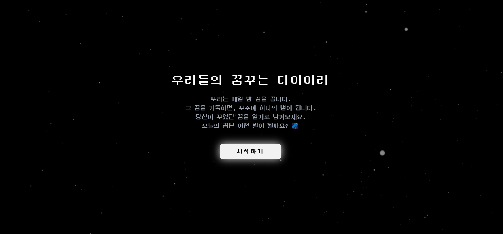
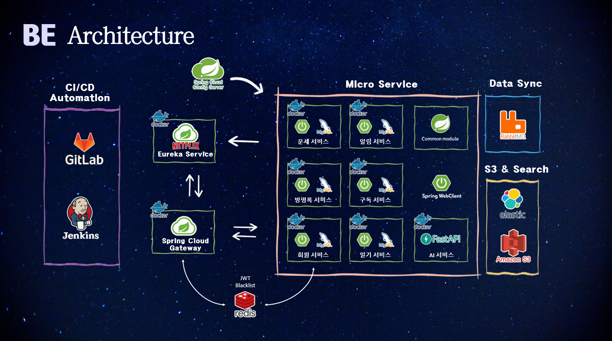
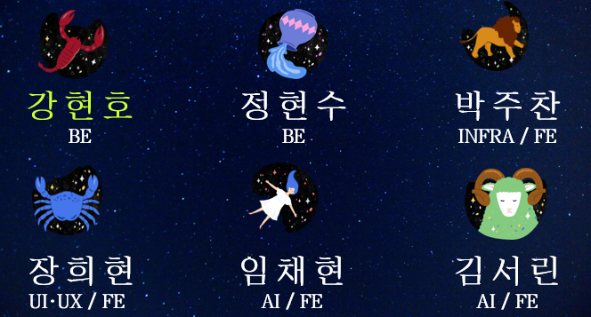

# 🤩 꿈을 우주의 별로 기록하고 AI 영상으로 보여주는 우꿈다 서비스



- 배포 URL : https://j12c202.p.ssafy.io/

<br>

## 프로젝트 소개

- 꿈을 우주의 별로 기록하고, 꿈 내용을 바탕으로 AI영상을 생성하여 즐거움을 주는 서비스입니다.

<br>

## 팀원 구성

<div align="center">

|                                     **강현호**                                     |                                     **정현수**                                      |                                     **박주찬**                                      |                                     **장희현**                                      |                                     **임채현**                                      |                                     **김서린**                                      |
| :--------------------------------------------------------------------------------: | :---------------------------------------------------------------------------------: | :---------------------------------------------------------------------------------: | :---------------------------------------------------------------------------------: | :---------------------------------------------------------------------------------: | :---------------------------------------------------------------------------------: |
|  |  |  |  |  |  |


</div>

<br>

## 1. 개발 환경

- **Front-end**:  
  React 18, TypeScript, Redux Toolkit, Tailwind CSS, Axios, React Router, react-three-fiber, drei

- **Back-end**:  
  Spring Boot 3.x, Spring Security, Spring WebFlux & MVC, Spring Data JPA, MySQL, Redis, RabbitMQ, ElasticSearch, FastAPI

- **버전 및 이슈 관리**:  
  GitLab + Git Flow 전략, Jira (Sprint 기반 태스크 관리), Notion (트러블슈팅 및 문서화)

- **협업 툴**:  
  Mattermost (실시간 커뮤니케이션), Figma (디자인), Google Drive (자료 공유), Draw.io (아키텍처 다이어그램)

- **서비스 배포 환경**:  
  AWS EC2, Docker Compose, Jenkins, Nginx + Let's Encrypt(HTTPS), Docker Hub, Prometheus + Grafana + Loki (모니터링)

- **디자인**:  
  Figma 기반 프로토타입, 사용자 시나리오 기반 UI/UX 구성, 3D 별자리 감정 표현 시각화 중심 디자인


<br>

## 2. 채택한 개발 기술과 브랜치 전략

### React

- React 기반의 SPA 구조로 전체 UI 구현
- React Router를 통해 페이지 전환 없이 부드러운 UX 제공
- 상태 관리는 Redux / Redux-toolkit을 채택하여 전역 상태(모달, 알림, 로그인 등) 일관되게 관리

### three.js

- 3D 별자리 구현을 위해 three.js + react-three-fiber 조합 활용
- Drei 라이브러리를 통해 `OrbitControls`, `Stars`, `useGLTF` 등 3D 시각화 보조 기능 간편하게 구현
- 별 생성, 확대, 반짝임 등의 효과를 통해 사용자의 감정을 시각화한 우주 공간 구성

### Spring

- Spring Boot 기반의 마이크로서비스 아키텍처(MSA) 구성
- 각 서비스는 Spring Web(MVC or WebFlux), Spring Security, Spring Data JPA 기반으로 구축
- 인증/인가: JWT + Redis 기반으로 사용자 인증 토큰 관리
- 비동기 이벤트 처리: RabbitMQ를 이용한 알림/검색 인덱싱 메시지 처리
- 검색 기능: ElasticSearch 연동, 한국어 자연어 처리를 위한 커스텀 analyzer 구성
- 공통 모듈화: 공통 예외 처리, 응답 포맷, 유틸을 공용 모듈로 분리해 일관성 유지

### SSE (Server-Sent Events)

- 실시간 알림 구현을 위해 SSE 기반의 단방향 푸시 시스템 구현
- 사용자의 알림 구독 요청 시 SseEmitter를 통해 연결 유지
- `notification-service`는 RabbitMQ로부터 메시지를 수신한 뒤, 해당 유저에게 SSE로 알림 전송
- 연결 끊김, 재연결, 다중 탭 등 다양한 상황을 고려한 안정적 연결 관리 로직 구성

### FastAPI

- AI 영상 생성 서버를 Python 기반의 **FastAPI**로 구축
- 비동기 처리를 지원하여 ChatGPT, Stable Diffusion, Runway 모델 호출을 빠르게 처리
- 텍스트 → 키워드 → 이미지 → 영상 생성 파이프라인을 각 API로 분리해 유지보수성과 확장성 확보
- 프론트 요청 → 백엔드 → FastAPI → AI 모델 실행 → S3 업로드 후 결과 반환까지 일관된 흐름으로 연동

---

### 브랜치 전략

- Git-flow 전략에서 주요 통합은 dev 브랜치에서 관리했습니다.
- dev 브랜치는 실제 개발의 메인 브랜치로 활용되며, 모든 기능 개발 및 급한 수정(Hotfix) 사항을 통합&테스트 했습니다.
- feature 브랜치는 개별 기능이나 개선 사항을 독립적으로 작업하기 위해 사용했습니다.
- 브랜치 이름은 feature/ 뒤에 작업 도메인(예: FE, AI, BE, INFRA)와 기능 설명, 그리고 뒤에 JIRA 티켓 번호를 붙이는 형식으로 관리합니다.
- TIL 브랜치는 개발 중 배운 내용이나 경험을 정리하는 용도로 운영했습니다.

```
master
└── dev
       ├── feature/AI
       │   └── feature/AI-video-creat/123
       ├── feature/BE
       │   ├── feature/BE-auth-api/124
       │   └── feature/BE-logging/125
       ├── feature/FE
       │   ├── feature/FE-login-page/126
       │   └── feature/FE-user-profile/127
       └── hotfix/login-bugfix

```

<br>

## 3. 프로젝트 구조

```
woo-ggum-da/
├── frontend/
│   ├── .eslint.js
│   ├── .prettierrc
│   ├── tsconfig.json
│   ├── package-lock.json
│   ├── package.json
│   ├── index.html
│   ├── public/
│   │   ├── 3d_component.gtlf
│   │   └── 3d_component.fbx
│   └── src/
│       ├── components/         # 공통 UI 컴포넌트
│       ├── hooks/              # 공통 React 훅
│       ├── stores/             # 글로벌 Redux 상태 관리
│       ├── routers/            # 글로벌 라우팅 설정
│       ├── apis/               # API 관련 코드
│       ├── themes/             # 스타일/테마 관련 파일
│       ├── types/              # 타입 파일
│       ├── domains/
│       │   ├── 기능1 (ex. Login)/
│       │   │   ├── components/
│       │   │   ├── pages/      # 보이는 페이지
│       │   │   ├── hooks/
│       │   │   ├── stores/
│       │   │   ├── apis/       # API 관련 코드
│       │   │   └── themes/
│       │   └── 기능2 (ex. SignUp)/
│       ├── config.ts           # 환경 변수 및 설정
│       ├── App.tsx             # 앱 루트
│       ├── main.tsx            # React 엔트리 포인트
│       ├── .prettierrc
│       ├── eslint.config.js
│       ├── tailwind.config.js
│       ├── vite.config.js
│       ├── jsconfig.json
│       └── index.css           # 글로벌 스타일
│
├── backend/
│   ├── package.json
│   ├── src/
│   └── config/
│
├── AI/
│   ├── app/
│   │   ├── config/
│   │   ├── core/               # chain, 프롬프트
│   │   └── models/             # DTO
│   │       ├── request/
│   │       └── response/
│   └── main.py

...
```

<br>

## 4. 프로젝트 아키텍쳐



## 5. 역할 분담

### 🍜강현호

- **Backend**
  - **JWT + Redis 기반 인증 인프라 구축**  
    → Gateway에서 인증 필터 처리, `Access/Refresh` 토큰 구조 구현, Redis 블랙리스트 포함
  - **ElasticSearch 연동 및 Nori/NGram 기반 검색 로직 구현**
    - 일기/유저 검색 인덱싱 자동화
    - `Analyzer`, `Tokenizer`, `Transactional` 관련 트러블 다수 해결
  - **RabbitMQ 기반 비동기 메시징 시스템 설계**
    - 서비스 간 느슨한 결합을 위한 이벤트 발행 구조 구성
    - `AlarmMessage` 구조 정의 및 알림 시스템 연동
  - **SSE 기반 실시간 알림 흐름 구축**
    - emitter 등록, 연결 유지, 오류 처리 등 세부 흐름 설계
    - 메시지 수신 시 유저별 알림 push 흐름 구현

- **3D 우주 시각화**
  - 일기 데이터를 기반으로 한 **3D 별 좌표 알고리즘 구현**
  - 클러스터링 및 ForceDirected 기반으로 사용자별 별 배치 위치 자동 생성
  - 사용자 경험을 고려한 좌표 재배치 기능 추가

<br>

<details>
<summary><strong>🧯 트러블슈팅 주요 사례</strong></summary>

#### 🔸 Spring Security + Redis 연동 문제

- 토큰 해시 처리 후 Redis key 확인 시 블로킹 문제 발생  
  → `Mono.fromCallable` + `Schedulers.boundedElastic()`로 비동기 안전 처리

#### 🔸 ElasticSearch 분석기 동작 오류

- 조건에 따라 검색 결과가 누락되거나 분석기가 무시되는 문제
  → `nori_tokenizer`, `ngram_filter`, `custom analyzer`로 직접 해결

#### 🔸 RabbitMQ Exchange 설정 누락

- 알림 메시지가 Queue에 도달하지 않음
  → Exchange와 RoutingKey 바인딩 누락 확인 후 `binding()` 직접 구성

#### 🔸 SSE 연결 중단 & 예외 처리

- 클라이언트 브라우저가 끊겨도 emitter가 계속 살아있는 문제
  → `onCompletion`, `onTimeout`, `onError` 통해 emitter 안전 제거 로직 구현

#### 🔸 DTO 파라미터 바인딩 실패

- `@ModelAttribute` 사용 시 DTO에 `@Setter`가 없어 모든 값이 null로 들어옴
  → `@Data` 또는 `@Setter` 추가하여 해결

</details>


<br>

### 🍖정현수

- **Backend**
  - MSA 인프라 구성  
    → `Eureka`, `Gateway` 설정 및 서비스 등록/탐색 구성
  - 공통 모듈 설계  
    → 응답 포맷, 예외 처리 로직을 `common-module`로 분리하여 일관성 및 재사용성 확보
  - WebClient 최적화  
    → 방명록 기능에서 발생한 N+1 문제 해결을 위해 `Bulk API` 방식 도입
  - 배치 스케줄러 구현  
    → Redis TTL 기반 삭제 방식을 제거하고, `Spring Batch + MySQL`로 일괄 삭제 처리
  - 코드 품질 개선  
    → `SonarQube` 도입을 통해 정적 분석 수행 및 리팩토링 가이드 적용

<br>

<details>
<summary><strong>✅ 구현 내용 자세히 보기</strong></summary>

#### 🔹 MSA 구축
- `Eureka`를 통한 서비스 등록 및 발견
- `Gateway`에서 JWT 필터를 통해 인가 처리
- `User-service`에서 인증 처리 담당
- 공통 응답 및 예외 처리를 위해 `common-module` 도입

#### 🔹 방명록 서비스
- `WebClient`로 작성자 정보(id, profileImg) 요청 시 N+1 문제 발생  
  → `writerSeq` 리스트를 한 번에 요청하는 `Bulk API`로 리팩토링
- 페이지네이션 처리로 효율적인 데이터 조회 구현

#### 🔹 행운 서비스
- Redis TTL 방식의 데이터 삭제 → 스케줄러 기반 `MySQL + Spring Batch` 삭제 방식으로 리팩토링
- 꿈 해몽 기능에서 `diarySeq` 기준으로 존재 여부 체크 후  
  → 기존 데이터 수정 또는 신규 생성 처리

#### 🔹 구독 서비스
- 구독 상태 변경을 `PATCH` 하나의 메서드로 통일
- 회원 탈퇴 시 `RabbitMQ` 이벤트를 통해 구독 자동 해제  
  → 비동기 이벤트 기반 구조로 신뢰성 강화

#### 🔹 코드 품질 관리
- `SonarQube`를 통한 코드 정적 분석 및 보안 취약점 탐지
- 예: `Collectors.toList()` → `toList()`로 리팩토링하여 가독성 향상

</details>

<details>
<summary><strong>🧯 트러블슈팅</strong></summary>

#### 🔸 WebClient N+1 문제
- **문제**: 방명록 작성자 정보를 매번 개별 조회하며 N+1 문제 발생  
- **해결**: `writerSeq`를 한 번에 수집하고 Bulk API로 사용자 정보 한 번에 조회

#### 🔸 Redis TTL의 불안정성
- **문제**: TTL 만료 시점이 명확하지 않아 스케줄 관리 어려움  
- **해결**: `Spring Batch` 기반 일괄 삭제 방식으로 전환

#### 🔸 꿈 해몽 중복 생성
- **문제**: 동일 `diarySeq`에 대해 해몽이 중복 생성  
- **해결**: 존재 시 수정, 없을 경우에만 새로 생성

#### 🔸 구독 동기 통신 문제
- **문제**: 탈퇴와 구독 해제 타이밍이 맞지 않음  
- **해결**: `RabbitMQ` 이벤트 기반 비동기 통신으로 신뢰성 확보

</details>


<br>

### 🍶박주찬

- **Infra**
  - 배포 서버 인프라 구축
  - `Prometheus`와 `Grafana`를 활용한 모니터링 시스템 구성
  - `Jenkins` 기반 CI/CD 파이프라인 구축
  - `Docker Compose`로 서비스 운영 환경 정리

- **Frontend**
  - 행운의 숫자 기능에서 별자리 애니메이션 구현
  - 마이페이지 회원정보 수정 기능 개발
  - 마이페이지 아이콘 관련 커스텀 함수 개발  
    (아이콘 ID 매핑, 랜덤 생성 로직, 특별 아이콘 확률 적용)
  - Redux를 활용한 모달 상태 관리 시스템 구현  
    → props 없이도 자식 컴포넌트에서 부모의 모달 제어 가능
  - 검색 기능 구현 및 검색 결과 상태 관리 최적화
  - 히어로 페이지 디자인 및 전체 레이아웃 구현
  - 페이지 이동 시 CSS 기반 애니메이션 효과 적용
  - 로딩 화면 UI 구현

<br>

<details>
<summary><strong>🧯 트러블슈팅</strong></summary>

#### 🔸 Kubernetes → Docker Compose로 전환
- **문제**: 쿠버네티스 환경에서 IP 충돌로 인한 배포 불가 문제 발생
- **해결**: `Docker Compose`를 사용하여 로컬 네트워크 기반으로 인프라 재구축

#### 🔸 Gateway 서비스 Excited 이슈
- **문제**: Gateway 서비스가 Docker에서 비정상 종료되는 문제 발생
- **해결**: Gateway 컨테이너 실행 시 `sleep` 대기 시간을 주어 순차 실행되도록 처리

#### 🔸 과도한 Props 전달
- **문제**: 프론트 컴포넌트를 잘게 쪼개다 보니 props 전달이 복잡해짐
- **해결**: 전역 상태 관리(Redux)로 props 사용 최소화 및 유지보수성 향상

#### 🔸 모달 상태 제어 어려움
- **문제**: 자식 컴포넌트에서 발생한 이벤트로 부모에서 모달 제어가 어려움
- **해결**: Redux로 모달 상태를 중앙 집중식으로 관리하여 위치에 상관없이 모달 제어 가능

#### 🔸 검색창 구독 리렌더링 이슈
- **문제**: 검색창에서 상태 변화 후에도 즉각 반영되지 않음
- **해결**: `useEffect`의 의존성 배열에 검색 상태를 추가하여 검색창 닫을 시 자동 reload되도록 수정

</details>

<br>

### 🍪장희현

- **Frontend**
  - 전체 UI/UX 디자인 및 목업 제작 (Figma)
  - 일기 작성 기능 (CRUD) 구현
  - Redux를 활용한 전역 상태 관리 및 API 연동
  - three.js 기반 우주 시각화 구현  
    → 작성한 일기가 3D 별로 시각화되도록 연동 및 시각 효과 구현
  - 로그인 / 방명록 / 검색 페이지 및 모달  
    → 일관된 스타일 유지 및 컴포넌트 정리

<br>

<details>
<summary><strong>🧯 트러블슈팅</strong></summary>

#### 🔸 더블클릭 이벤트 미작동 & 별 가림 현상

- **문제**: mesh 요소가 존재하는 위치에서 더블클릭 이벤트가 작동하지 않고, 특정 각도에서 별이 보이지 않는 현상 발생
- **원인**: mesh가 3D 공간 안에서 별을 가리거나 이벤트를 가로채고 있었음
- **해결**
  - mesh 요소 제거
  - 더블클릭 이벤트를 HTML `<div>` 요소로 위임
  - 별 위치를 랜덤 생성 방식으로 변경
  - 일기 작성 후 카메라가 해당 위치로 자동 이동하도록 구현
  - 반짝임 등 시각 효과로 사용자 인지성 강화

#### 🔸 React Three Fiber의 암시적 요소 사용 이해

- `<points>`, `<bufferGeometry>` 등의 요소를 import 없이 JSX로 사용하는 구조에 대한 이해 부족
- React Three Fiber에서는 Three.js 요소를 JSX로 암시적으로 사용 가능
- `<Canvas>` 내부에서 자동으로 Three 객체로 변환됨을 학습

</details>

<br>

### 🎂임채현

- **AI**
  - Text-to-Video `WangchanBERT-Wan2.1` 기반 모델에 대해 `LoRA` 파인튜닝 실험 진행
  - `FastAPI` 기반 AI 서버 초기 구성 및 라우팅 설정

- **Frontend**
  - 프로젝트 초기 `React` 구조 세팅
  - `axios` 인터셉터 설정을 통한 공통 에러 처리 및 인증 토큰 적용
  - 회원가입/로그인 API 연동
  - 랜덤 유저 탐색 페이지 API 연동
  - 별 CRUD 기반 별자리 연결 상태 관리
  - `SSE` 기반 실시간 알림 팝업 구현
  - 알림 상태에 따른 바로가기 기능 구현
  - `redux-toolkit` 기반 전역 상태관리 구조 도입 및 적용


<br>

<details>
<summary><strong>🧯 트러블슈팅</strong></summary>

#### 🔸 RefreshToken으로 토큰 재발급 무한 호출 이슈
- **문제**: 기존 API 요청이 401 에러 발생 시 토큰 갱신을 위해 요청을 재시도 하면서 401 무한 에러 발생
- **해결**: 토큰 갱신을 위해 대기 요청 큐를 활용하고 401, 403 분기별로 갱신 및 실패 로직 구상

#### 🔸 과도한 Props 전달
- **문제**: 프론트 컴포넌트를 잘게 쪼개다 보니 props 전달이 복잡해짐
- **해결**: 전역 상태 관리(Redux)로 props 사용 최소화 및 유지보수성 향상

#### 🔸45초마다 연결 끊김 이슈 & heatbeat와 ping과 서로 충돌
- **문제**: SSE 연결 시 타임아웃에 민감하게 반응하여 튕김 발생
- **해결**: 백엔드와 핑테스트, 하트비트를 서로소로 interval 지정하여 신호를 확인

</details>
<br>

### 🍚김서린

- **AI + Frontend**
  - 사용자 텍스트 기반 **AI 감성 영상 생성 기능** 개발
  - **FastAPI + LangChain 파이프라인** 구성  
    → ChatGPT 요약/키워드 추출 → Stable Diffusion 이미지 생성 → Gen-3 영상 생성
  - 방명록 기능 구현 및 프론트 연동 (자유 작성 + 페이지네이션)
  - 꿈 대시보드 UI 및 감정 분석 기반 시각화 기능 개발
  - 감정 결과 기반 배경음악 추천 및 재생 로직 구현

<br>

<details>
<summary><strong>🌌 페이지별 주요 기능</strong></summary>

#### ⭐️ 일기(별자리) 모달 - AI 영상 생성

- 사용자가 작성한 **일기 텍스트를 기반으로 감성 영상 생성**
- FastAPI 서버에서 LangChain 기반 AI 파이프라인 구성:
  - `ChatGPT` → 텍스트 요약 + 키워드 추출
  - `Stable Diffusion 3.5` → 이미지 생성
  - `Gen-3` → 영상 생성
- 결과 영상을 모달에서 바로 재생하여 사용자 몰입감 강화

#### 📊 꿈 대시보드

- 2주/1개월간 작성한 일기를 **감정별로 분류 및 시각화**
- 가장 높은 감정 기반으로 음악 추천
- 사용자가 배경음악을 선택하면 **자동 재생 로직** 처리

#### 💬 방명록 모달

- 사용자가 자유롭게 메시지를 남길 수 있는 방명록 기능
- 페이지네이션 적용으로 많은 메시지에도 깔끔한 UI 유지

</details>

<br>

## 6. 개발 기간 및 작업 관리

### 개발 기간

- 전체 개발 기간 : 2025-02-24 ~ 2025-04-11
- 아이디어 기획 : 2025-02-24 ~ 2025-02-28
- UI 구현 : 2025-03-07 ~ 2025-03-21
- 기능 구현 : 2025-03-17 ~ 2025-04-11

<br>

### 작업 관리

- **GitLab 기반 Git Flow 브랜치 전략**을 사용하여 협업을 체계적으로 진행했습니다.
  - `dev` 브랜치를 중심으로 각 기능은 `feature/도메인-기능/이슈번호` 형식으로 관리
  - 공통/반복되는 브랜치 네이밍 룰을 통해 협업 시 충돌을 최소화
- **Jira + Notion을 통한 이슈/기록 관리**
  - Jira를 활용해 Sprint 단위로 태스크를 분리하고 우선순위 기반 태스크 관리
  - Notion에 실시간 트러블슈팅 보드를 운영하여 팀원 전체가 기술 이슈를 공유하고 빠르게 해결
- **Daily Stand-up 및 코드 리뷰**
  - 매일 아침 회의를 통해 진행 상황과 막힌 점 공유
  - PR마다 최소 1인 이상의 코드 리뷰를 필수로 진행하여 코드 품질 유지
- **CI/CD 자동화 및 배포 효율화**
  - Jenkins + Docker Compose + AWS EC2 환경에서 자동화된 배포 파이프라인 구성
  - Mattermost 연동으로 빌드 결과 실시간 공유

---

<br>

## 7. 신경 쓴 부분

- **3D 별자리 UI/UX 경험**
  - 사용자의 꿈과 감정을 별로 표현하는 시각화에서 단순한 랜덤 배치가 아닌, 감정 기반 위치 배치, 반짝임 효과, 확대 애니메이션 등 UX적 감성을 고려
  - `three.js + react-three-fiber + drei` 조합을 통해 자연스러운 3D 우주 공간 구성
  - 별 생성 로직은 백엔드에서 좌표 알고리즘 기반으로 제공하여 일관성 유지

- **AI 기반 영상 생성**
  - 꿈 내용을 기반으로 키워드 추출 → 이미지 생성 → 영상 생성 순으로 파이프라인 설계
  - ChatGPT, Stable Diffusion 3.5, Gen-3 모델을 활용하여 감정 기반 꿈 영상 생성
  - LangChain 기반 프롬프트 체인 구성으로 키워드 품질 향상
  - 영상 결과는 S3에 업로드 후 백엔드와 연결되어 프론트에서 재생

- **실시간 알림 시스템**
  - 메시지 발행 서비스와 알림 전송 서비스를 분리하여 비동기 메시징 구조 설계
  - RabbitMQ를 통해 알림 메시지 발행 → SSE로 사용자에게 실시간 알림 전달
  - Emitter 연결 끊김 방지와 재연결 핸들링, 다중 탭 대응을 고려한 안정적 설계

- **ElasticSearch 기반 검색 기능**
  - 사용자와 일기에 대해 Nori Tokenizer + Edge Ngram 기반의 검색 인덱싱 구성
  - 검색 조건(제목/내용/태그/작성자)에 따라 부분 일치와 키워드 분석이 되도록 Analyzer 커스터마이징
  - 실시간 인덱스 업데이트 로직으로 CRUD 동기화 보장

- **확장성과 유지보수성을 고려한 MSA 설계**
  - 총 9개 이상의 마이크로서비스로 구성된 구조에서 공통 모듈(common-module), 통합 gateway, Eureka 등록, config-service 기반 환경관리 구성
  - WebClient, FeignClient, RabbitMQ 등 서비스간 통신 방식은 기능에 따라 유연하게 혼용
  - 각 서비스는 기능 단위로 명확히 분리되어 장애 격리와 독립 배포 가능

- **프론트엔드 컴포넌트 설계 및 상태 관리**
  - Zustand 대신 Redux/Redux-toolkit을 선택하여 복잡한 전역 상태(모달, 알림 등) 처리
  - 컴포넌트 재사용성과 가독성을 고려하여 도메인 기반 디렉토리 설계 및 모듈화
  - UX를 고려한 히어로 페이지, 우주선 페이지 등 구성

- **인프라 자동화와 모니터링**
  - Jenkins 기반 CI/CD 구축으로 GitLab 브랜치 Merge 시 자동 배포
  - Prometheus + Grafana + Loki를 활용하여 컨테이너 모니터링, 로그 분석 시스템 구축
  - Nginx + Let’s Encrypt를 활용한 HTTPS 적용 및 보안 설정 완료


<br>

## 7. 페이지별 기능

### [히어로 페이지]

| 히어로 페이지                                                                             |
| ----------------------------------------------------------------------------------------- |
|  |

<br>

### [로그인/회원가입 페이지 ]


| 로그인/ 회원가입 페이지                                                                             |
| --------------------------------------------------------------------------------------------------- |
|  |

<br>

### [메인페이지]


| 메인 별자리 페이지                                                                                      |
| ------------------------------------------------------------------------------------------------------- |
|  |

<br>

### [일기(별자리) 모달]

-

| 일기생성완료 알림                                                                                        |
| ---------------------------------------------------------------------------------------------------- |
|  |

| 일기 AI영상, 꿈일기, 꿈 해몽 보기                                                                    |
| ---------------------------------------------------------------------------------------------------- |
|  |

| 일기 작성하기                                                                                        |
| ---------------------------------------------------------------------------------------------------- |
|  |

<br>

### [우주선 페이지]


| 우주선 페이지 이동                                    |
| ------------------------------------------------------------------------------------------------ |
|  |

<br>

### [꿈 대시보드]


| 꿈 대시보드 페이지                                                                             |
| ---------------------------------------------------------------------------------------------- |
|  |

<br>

### [행운번호 뽑기 페이지]


| 행운번호 뽑기 페이지          |
| ----------------------------- |
|  |

<br>

### [오늘의 운세 페이지]


| 오늘의 운세 페이지              |
| ------------------------------- |
|  |

<br>

### [방명록 모달]


| 방명록 모달                             |
| --------------------------------------- |
| |

<br>

### [검색 모달]


| 유저검색 모달                           |
| --------------------------------------- |
|  |

| 일기검색 모달                           |
| --------------------------------------- |
|  |

<br>

### [블랙홀]


| 블랙홀 페이지                                                                             |
| ----------------------------------------------------------------------------------------- |
|  |

<br>

| 팀원 소개                                                                             |
| ----------------------------------------------------------------------------------------- |
| 
