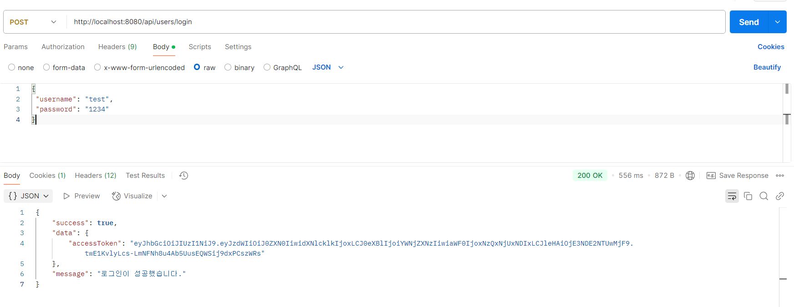
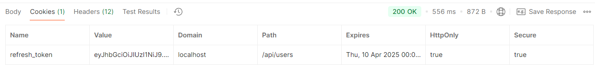
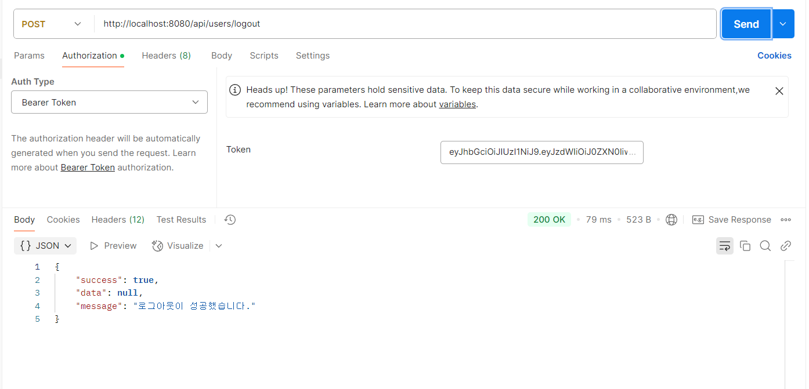
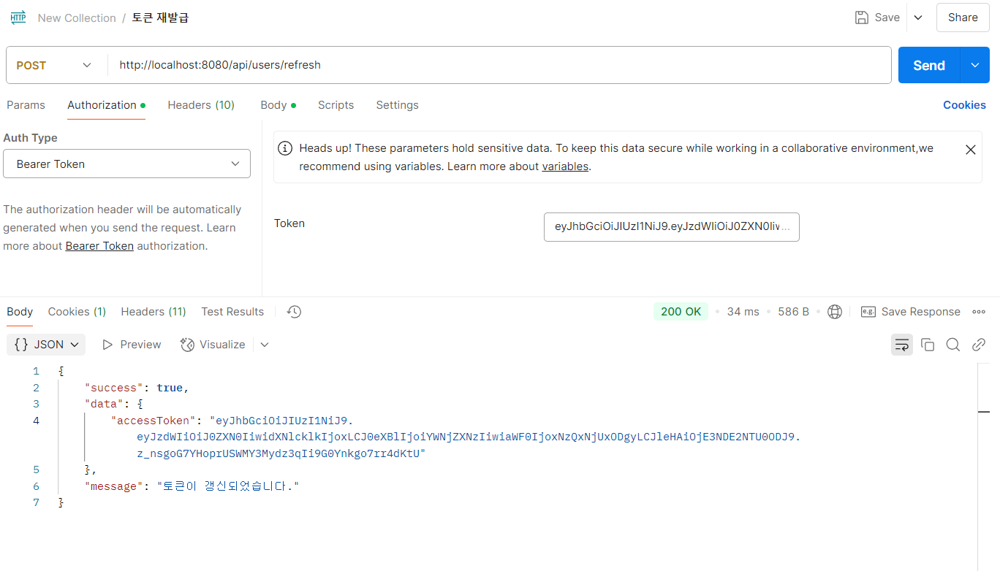

<details>
  <summary><b>2025-03-04(Project Management)</b></summary>

  # 25.03.04 (화)
  ## PM(Project Management) 모듈형 강의 1회차

  1. AI가 대체할 수 없는 부분
      - 대인 관계와 감성적인 이해(공감 능력)
      - 리더십 & 동기 부여
      - 불확실한 상황 속에서 의사 결정
  2. 갈등 관리 전략
      1. 문제해결/협력
          1. 이해관계자에게 중대하고 반드시 극복해야 하는 갈등
          2. 갈등해결 과정이 배움으로 큰 의미를 가질 때
        3. 프로젝트 계획수립 단계의 핵심 의사 결정
      2. 강압/경쟁
          1. 긴급한 의사결정을 해야 하는 갈등(안전과 관련된 사안 || 프로젝트 마지막 쯤)
          2. 모든 이해관계자가 하기 싫어하는 일을 해야 할 때(ex. 문서 작업, 원가 절감)
          3. 당신이 경쟁에서 승리 70퍼 넘을 때
          4. **부정적인 효과**가 오래 지속
      3. 회피/지연
          1. 중요도가 낮은 갈등
          2. 감정적으로 격앙
          3. 해결의 가능성이 매우 희박한 경우 → 테스트 해야 알 수 있을 때
      4. 수용/수습 선택 상홯
          1. 과거에 대한 교훈과 미래의 신뢰를 구축해야 하는 갈등
          2. 내 잘못이 명백
          3. 일정 누락, 관리 실패 
      5. 타협/절충
          1. 해결을 위한 노력을 최소화 하고 싶을 때
          2. 대등한 힘을 가지고 다른 목표를 추구할 때
</details>

---------------------------------------

<details>
<summary><b>2025-03-05(Spring Batch + Scheduler)</b></summary>

# 25.03.05 (수)  Spring Batch + Scheduler
## Spring Batch
- **개념**
    - 대용량 데이터 처리를 위한 배치 프레임워크
    - 정해진 시간에 대량의 데이터를 처리
- **주요 구성 요소**
    - Job: 배치 처리 과정 하나를 의미
    - Step: Job의 실제 처리 단위
    - ItemReader: 데이터 읽기
    - ItemProcessor: 데이터 처리
    - ItemWriter: 데이터 쓰기
- **특징**
    - 자동화된 실행
    - 재시작 기능
    - 로깅/추적 기능
    - 트랜잭션 관리
#### 만약 프로젝트에서 사용한다면
    **트랜잭션 관리**:
    - Step 단위의 트랜잭션 관리로 실패하는 경우 롤백 가능
    - 장애가 발생했을 때 실패한 작업만 재퍼리 가능
    - 오류를 로그로 기록


    **정기적인 데이터 처리**:
    - 꿈의 x,y,z 좌표를 재설정, 설정을 실시간으로 하기 힘들다면 일정 시간에 일괄 처리하면 좋을 듯 합니다 -> Spring Scheduler와 연동해 일정 시간에 자동 처리

## Spring Scheduler

Spring Scheduler는 작업을 주기적으로 실행할 수 있게 해주는 기능

- **@EnableScheduling** 어노테이션으로 활성화
- **@Scheduled** 어노테이션을 사용하여 메서드에 스케줄 지정
- Cron 표현식을 사용하여 복잡한 스케줄링 가능


## Spring Batch + Scheduler 조합

Spring Batch와 Scheduler를 함께 사용하면 강력한 주기적 배치 처리 시스템을 구축할 수 있습니다:

1. Spring Batch로 배치 Job 구성
2. Scheduler로 Job 실행 주기 설정
3. 정기적으로 대량 데이터 처리 자동화

### 구현 방법

1. 의존성 추가 (Gradle):
   ```gradle
   implementation 'org.springframework.boot:spring-boot-starter-batch'
   implementation 'org.springframework.boot:spring-boot-starter-quartz'
   ```

2. BatchConfig 설정:
   ```java
   @Configuration
   @EnableBatchProcessing
   public class BatchConfig {
       @Autowired
       public JobBuilderFactory jobBuilderFactory;
       @Autowired
       public StepBuilderFactory stepBuilderFactory;

       @Bean
       public Job job() {
           return jobBuilderFactory.get("dreamCoordinatesJob")
               .start(step())
               .build();
       }

       @Bean
       public Step step() {
           return stepBuilderFactory.get("dreamCoordinatesStep")
               .tasklet((contribution, chunkContext) -> {
                   // 꿈의 좌표 재설정 로직
                   return RepeatStatus.FINISHED;
               })
               .build();
       }
   }
   ```

3. Scheduler 설정:
   ```java
   @Component
   public class BatchScheduler {
       @Autowired
       private JobLauncher jobLauncher;
       @Autowired
       private BatchConfig batchConfig;

       @Scheduled(cron = "0 0 0 * * ?") // 매일 자정에 실행
       public void runJob() {
           try {
               jobLauncher.run(batchConfig.job(), new JobParameters());
           } catch (Exception e) {
               // 에러 처리
           }
       }
   }
   ```

4. 메인 애플리케이션 클래스에 어노테이션 추가:
   ```java
   @EnableScheduling
   @EnableBatchProcessing
   @SpringBootApplication
   public class DreamApplication {
       public static void main(String[] args) {
           SpringApplication.run(DreamApplication.class, args);
       }
   }
   ```
</details>


----------------------------------------

<details>
<summary><b>2025-03-06(Spring Jwt + Security)</b></summary>

# 25.03.06 (목)
## 주요 구현 코드(Jwt, Security)
- MSA 적용 테스트를 위해 userservice 프로젝트 생성
### 1. JwtTokenProvider 
```java
@Component
@RequiredArgsConstructor
@Slf4j
public class JwtTokenProvider {

    @Value("${jwt.secret-key}")
    private String secretKey;

    @Value("${jwt.access-token-validity-in-ms}")
    private long accessTokenValidity;

    private Key key;
    private final UserDetailsService userDetailsService;

    @PostConstruct
    public void init() {
        String encodedKey = Base64.getEncoder().encodeToString(secretKey.getBytes());
        key = Keys.hmacShaKeyFor(encodedKey.getBytes());
    }

    public String createToken(String username, Long userId) {
        Claims claims = Jwts.claims().setSubject(username);
        claims.put("userId", userId);
        Date now = new Date();
        Date validity = new Date(now.getTime() + accessTokenValidity);

        return Jwts.builder()
                .setClaims(claims)
                .setIssuedAt(now)
                .setExpiration(validity)
                .signWith(key, SignatureAlgorithm.HS256)
                .compact();
    }

    public Authentication getAuthentication(String token) {
        UserDetails userDetails = this.userDetailsService.loadUserByUsername(getUsername(token));
        return new UsernamePasswordAuthenticationToken(userDetails, "", userDetails.getAuthorities());
    }

    public String getUsername(String token) {
        return Jwts.parserBuilder().setSigningKey(key).build().parseClaimsJws(token).getBody().getSubject();
    }

    public boolean validateToken(String token) {
        try {
            Jws<Claims> claims = Jwts.parserBuilder().setSigningKey(key).build().parseClaimsJws(token);
            return !claims.getBody().getExpiration().before(new Date());
        } catch (JwtException | IllegalArgumentException e) {
            return false;
        }
```

### 2. JwtAuthenticationFilter 
```java
@Component
@RequiredArgsConstructor
@Slf4j
public class JwtAuthenticationFilter extends OncePerRequestFilter {

    private final JwtTokenProvider jwtTokenProvider;

    @Override
    protected void doFilterInternal(HttpServletRequest request, HttpServletResponse response, FilterChain filterChain)
            throws ServletException, IOException {

        String token = resolveToken(request);

        if (token != null && jwtTokenProvider.validateToken(token)) {
            Authentication auth = jwtTokenProvider.getAuthentication(token);
            SecurityContextHolder.getContext().setAuthentication(auth);
        }

        filterChain.doFilter(request, response);
    }

    private String resolveToken(HttpServletRequest request) {
        String bearerToken = request.getHeader("Authorization");
        if (StringUtils.hasText(bearerToken) && bearerToken.startsWith("Bearer ")) {
            return bearerToken.substring(7);
        }
        return null;
    }
```
### 3. SecurityConfig
```java
@Configuration
@EnableWebSecurity
@RequiredArgsConstructor
public class SecurityConfig {

    private final JwtTokenProvider jwtTokenProvider;
    private final JwtAuthenticationEntryPoint authenticationEntryPoint;
    private final UserDetailsService userDetailsService;

    @Bean
    public SecurityFilterChain filterChain(HttpSecurity http) throws Exception {
        http
                // CSRF 보호 비활성화 (JWT 사용으로 불필요)
                .csrf(csrf -> csrf.disable())

                // 세션 관리 설정: STATELESS (JWT 사용으로 세션 사용 안함)
                .sessionManagement(session -> session
                        .sessionCreationPolicy(SessionCreationPolicy.STATELESS))

                // 예외 처리 설정
                .exceptionHandling(exception -> exception
                        .authenticationEntryPoint(authenticationEntryPoint))

                // 엔드포인트 권한 설정
                .authorizeHttpRequests(authorize -> authorize
                        // 공개 엔드포인트 설정
                        .requestMatchers("/api/users/signup", "/api/users/login", "/api/users/check/**").permitAll()
                        // 인증된 사용자만 접근 가능한 엔드포인트
                        .anyRequest().authenticated())

                // JWT 필터 추가 (UsernamePasswordAuthenticationFilter 전에 실행)
                .addFilterBefore(new JwtAuthenticationFilter(jwtTokenProvider),
                        UsernamePasswordAuthenticationFilter.class);

        return http.build();
    }

    @Bean
    public PasswordEncoder passwordEncoder() {
        return new BCryptPasswordEncoder();
    }

    @Bean
    public AuthenticationManager authenticationManager(AuthenticationConfiguration authenticationConfiguration) throws Exception {
        return authenticationConfiguration.getAuthenticationManager();
    }
}
```
## 오류 해결
# 오류

```java
 :: Spring Boot ::                (v3.4.3)

2025-03-06T08:24:56.339+09:00  INFO 27560 --- [userservice] [           main] c.c.userservice.UserserviceApplication   : Starting UserserviceApplication using Java 21.0.6 with PID 27560 (C:\Users\SSAFY\Desktop\HH_User_Service\userservice\build\classes\java\main started by SSAFY in C:\Users\SSAFY\Desktop\HH_User_Service\userservice)
2025-03-06T08:24:56.343+09:00  INFO 27560 --- [userservice] [           main] c.c.userservice.UserserviceApplication   : No active profile set, falling back to 1 default profile: "default"
2025-03-06T08:24:57.231+09:00  INFO 27560 --- [userservice] [           main] .s.d.r.c.RepositoryConfigurationDelegate : Bootstrapping Spring Data JPA repositories in DEFAULT mode.
2025-03-06T08:24:57.302+09:00  INFO 27560 --- [userservice] [           main] .s.d.r.c.RepositoryConfigurationDelegate : Finished Spring Data repository scanning in 62 ms. Found 1 JPA repository interface.
2025-03-06T08:24:57.990+09:00  INFO 27560 --- [userservice] [           main] o.s.b.w.embedded.tomcat.TomcatWebServer  : Tomcat initialized with port 8080 (http)
2025-03-06T08:24:58.007+09:00  INFO 27560 --- [userservice] [           main] o.apache.catalina.core.StandardService   : Starting service [Tomcat]
2025-03-06T08:24:58.008+09:00  INFO 27560 --- [userservice] [           main] o.apache.catalina.core.StandardEngine    : Starting Servlet engine: [Apache Tomcat/10.1.36]
2025-03-06T08:24:58.077+09:00  INFO 27560 --- [userservice] [           main] o.a.c.c.C.[Tomcat].[localhost].[/]       : Initializing Spring embedded WebApplicationContext
2025-03-06T08:24:58.078+09:00  INFO 27560 --- [userservice] [           main] w.s.c.ServletWebServerApplicationContext : Root WebApplicationContext: initialization completed in 1648 ms
2025-03-06T08:24:58.091+09:00 ERROR 27560 --- [userservice] [           main] o.s.b.web.embedded.tomcat.TomcatStarter  : Error starting Tomcat context. Exception: org.springframework.beans.factory.UnsatisfiedDependencyException. Message: Error creating bean with name 'jwtAuthenticationFilter' defined in file [C:\Users\SSAFY\Desktop\HH_User_Service\userservice\build\classes\java\main\com\c202\userservice\global\auth\JwtAuthenticationFilter.class]: Unsatisfied dependency expressed through constructor parameter 0: Error creating bean with name 'jwtTokenProvider' defined in file [C:\Users\SSAFY\Desktop\HH_User_Service\userservice\build\classes\java\main\com\c202\userservice\global\auth\JwtTokenProvider.class]: Unsatisfied dependency expressed through constructor parameter 0: No qualifying bean of type 'org.springframework.security.core.userdetails.UserDetailsService' available: expected at least 1 bean which qualifies as autowire candidate. Dependency annotations: {}
2025-03-06T08:24:58.126+09:00  INFO 27560 --- [userservice] [           main] o.apache.catalina.core.StandardService   : Stopping service [Tomcat]
2025-03-06T08:24:58.137+09:00  WARN 27560 --- [userservice] [           main] ConfigServletWebServerApplicationContext : Exception encountered during context initialization - cancelling refresh attempt: org.springframework.context.ApplicationContextException: Unable to start web server
2025-03-06T08:24:58.148+09:00  INFO 27560 --- [userservice] [           main] .s.b.a.l.ConditionEvaluationReportLogger : 

Error starting ApplicationContext. To display the condition evaluation report re-run your application with 'debug' enabled.
2025-03-06T08:24:58.176+09:00 ERROR 27560 --- [userservice] [           main] o.s.b.d.LoggingFailureAnalysisReporter   : 

***************************
APPLICATION FAILED TO START
***************************

Description:

Parameter 0 of constructor in com.c202.userservice.global.auth.JwtTokenProvider required a bean of type 'org.springframework.security.core.userdetails.UserDetailsService' that could not be found.

Action:

Consider defining a bean of type 'org.springframework.security.core.userdetails.UserDetailsService' in your configuration.

```

# 해결(Custom UserDetails, Service 구현)

Spring Security에서 `UserDetailsService` 빈을 찾을 수 없어서 발생하는 문제입니다. `JwtTokenProvider`가 생성자에서 `UserDetailsService`를 의존성으로 주입받으려 하는데, 이 빈이 없어서 문제가 발생.

이 문제를 해결하기 위해서는 `UserDetailsService` 구현체를 빈으로 등록.

```java
package com.c202.userservice.global.auth;

import com.c202.userservice.domain.user.entity.User;
import lombok.Getter;
import org.springframework.security.core.GrantedAuthority;
import org.springframework.security.core.authority.SimpleGrantedAuthority;
import org.springframework.security.core.userdetails.UserDetails;

import java.util.Collection;
import java.util.Collections;

@Getter
public class CustomUserDetails implements UserDetails {

    private final Long id;
    private final String username;
    private final String password;
    private final String nickName;
    private final Collection<? extends GrantedAuthority> authorities;

    public CustomUserDetails(User user) {
        this.id = user.getId();
        this.username = user.getUsername();
        this.password = user.getPassword();
        this.nickName = user.getNickname();
        this.authorities = Collections.singletonList(new SimpleGrantedAuthority("ROLE_USER"));
    }

    @Override
    public Collection<? extends GrantedAuthority> getAuthorities() {
        return authorities;
    }

    @Override
    public String getPassword() {
        return password;
    }

    @Override
    public String getUsername() {
        return username;
    }

    @Override
    public boolean isEnabled() {
        return true; // 계정 활성화 상태 미구현
    }

}

```

```java
package com.c202.userservice.global.auth;

import com.c202.userservice.domain.user.entity.User;
import com.c202.userservice.domain.user.repository.UserRepository;
import org.springframework.security.core.userdetails.UserDetails;
import org.springframework.security.core.userdetails.UserDetailsService;
import org.springframework.security.core.userdetails.UsernameNotFoundException;
import org.springframework.stereotype.Service;

@Service
public class CustomUserDetailsService implements UserDetailsService {

    private final UserRepository userRepository;

    public CustomUserDetailsService(UserRepository userRepository) {
        this.userRepository = userRepository;
    }
    @Override
    public UserDetails loadUserByUsername(String username) throws UsernameNotFoundException {
        User user = userRepository.findByUsername(username)
                .orElseThrow(() -> new UsernameNotFoundException(username));
        return new CustomUserDetails(user);
    }
}

```

</details>


------------------

<details>
<summary><b>2025-03-07(Spring Refresh token)</b></summary>

## Refresh Token 구현
### Refresh Token Entity
```java
package com.c202.userservice.global.auth.refreshtoken;

import jakarta.persistence.*;
import lombok.AllArgsConstructor;
import lombok.Builder;
import lombok.Getter;
import lombok.NoArgsConstructor;

@Entity
@Table(name = "refresh_tokens")
@Getter
@NoArgsConstructor
@AllArgsConstructor
@Builder
public class RefreshToken {

    @Id
    @GeneratedValue(strategy = GenerationType.IDENTITY)
    private Long id;

    // 사용자 ID와 매핑
    @Column(nullable = false)
    private Long userId;

    // 토큰 값 저장
    @Column(nullable = false, unique = true, length = 255)
    private String token;

    // 토큰 만료 시간
    @Column(nullable = false)
    private String expiryDate;

    // 토큰 값 업데이트 메소드
    public void updateToken(String token, String expiryDate) {
        this.token = token;
        this.expiryDate = expiryDate;
    }
}
```
### Refresh Token Repository

```java
package com.c202.userservice.global.auth.refreshtoken;

import org.springframework.data.jpa.repository.JpaRepository;

import java.util.Optional;

public interface RefreshTokenRepository extends JpaRepository<RefreshToken, Long> {


    // 토큰 값으로 리프레시 토큰 조회
    Optional<RefreshToken> findByToken(String token);

    // 사용자 ID로 리프레시 토큰 조회
    Optional<RefreshToken> findByUserId(Long userId);

    // 사용자 ID로 토큰 삭제 (로그아웃 시 사용)
    void deleteByUserId(Long userId);
}
```

### JwtTokenProvider에 refreshToken 메소드 추가

``` java
    // 리프레시 토큰 생성 메소드
    public String createRefreshToken(String username, Long userId) {
        // JWT 클레임 설정
        Claims claims = Jwts.claims().setSubject(username);
        claims.put("userId", userId);
        claims.put("type", "refresh"); // 토큰 타입 지정

        // 현재 시간과 만료 시간 설정
        Date now = new Date();
        Date validity = new Date(now.getTime() + refreshTokenValidity);

        // JWT 리프레시 토큰 생성
        String refreshToken = Jwts.builder()
                .setClaims(claims)
                .setIssuedAt(now)
                .setExpiration(validity)
                .signWith(key, SignatureAlgorithm.HS256)
                .compact();

        // 만료 시간을 문자열로 변환
        String expiryDate = LocalDateTime.now().plusNanos(refreshTokenValidity * 1000000).format(DATE_FORMATTER);

        // DB에 리프레시 토큰 저장 또는 업데이트
        Optional<RefreshToken> existingToken = refreshTokenRepository.findByUserId(userId);

        if (existingToken.isPresent()) {
            // 기존 토큰이 있으면 업데이트
            RefreshToken tokenEntity = existingToken.get();
            tokenEntity.updateToken(refreshToken, expiryDate);
            refreshTokenRepository.save(tokenEntity);
        } else {
            // 기존 토큰이 없으면 새로 생성
            RefreshToken tokenEntity = RefreshToken.builder()
                    .userId(userId)
                    .token(refreshToken)
                    .expiryDate(expiryDate)
                    .build();
            refreshTokenRepository.save(tokenEntity);
        }

        return refreshToken;
    }

    // 리프레시 토큰을 쿠키에 설정하는 메소드 추가
    public void addRefreshTokenToCookie(HttpServletResponse response, String refreshToken) {
        Cookie cookie = new Cookie("refresh_token", refreshToken);
        cookie.setHttpOnly(true);  // JavaScript에서 접근 불가능하게 설정
        cookie.setSecure(true);    // HTTPS에서만 전송 (운영 환경에서 활성화)
        cookie.setPath("/api/users");  // 쿠키 경로 설정
        cookie.setMaxAge((int) (refreshTokenValidity / 1000));  // 초 단위로 변환

        response.addCookie(cookie);
    }

    // 쿠키에서 리프레시 토큰 추출
    public String extractRefreshTokenFromCookie(HttpServletRequest request) {
        Cookie[] cookies = request.getCookies();
        if (cookies != null) {
            for (Cookie cookie : cookies) {
                if ("refresh_token".equals(cookie.getName())) {
                    return cookie.getValue();
                }
            }
        }
        return null;
    }

    // 리프레시 토큰 쿠키 삭제
    public void deleteRefreshTokenCookie(HttpServletResponse response) {
        Cookie cookie = new Cookie("refresh_token", null);
        cookie.setHttpOnly(true);
        cookie.setSecure(true);
        cookie.setPath("/api/users");
        cookie.setMaxAge(0);  // 즉시 만료

        response.addCookie(cookie);
    }

        // 리프레시 토큰으로 새 액세스 토큰 발급
    public String refreshAccessToken(String refreshToken) {
        // 리프레시 토큰 유효성 검증
        if (!validateToken(refreshToken)) {
            throw new ServiceException.AuthenticationException("유효하지 않은 리프레시 토큰입니다.");
        }

        // 토큰 타입 확인
        String tokenType = getTokenType(refreshToken);
        if (!"refresh".equals(tokenType)) {
            throw new ServiceException.AuthenticationException("유효한 리프레시 토큰이 아닙니다.");
        }

        // DB에 저장된 리프레시 토큰 확인
        Optional<RefreshToken> savedToken = refreshTokenRepository.findByToken(refreshToken);
        if (savedToken.isEmpty()) {
            throw new ServiceException.AuthenticationException("저장된 리프레시 토큰을 찾을 수 없습니다.");
        }

        // 토큰에서 사용자 정보 추출
        String username = getUsername(refreshToken);
        Long userId = getUserId(refreshToken);

        // 새 액세스 토큰 생성 및 반환
        return createAccessToken(username, userId);
    }

```
### 테스트 결과




</details>
