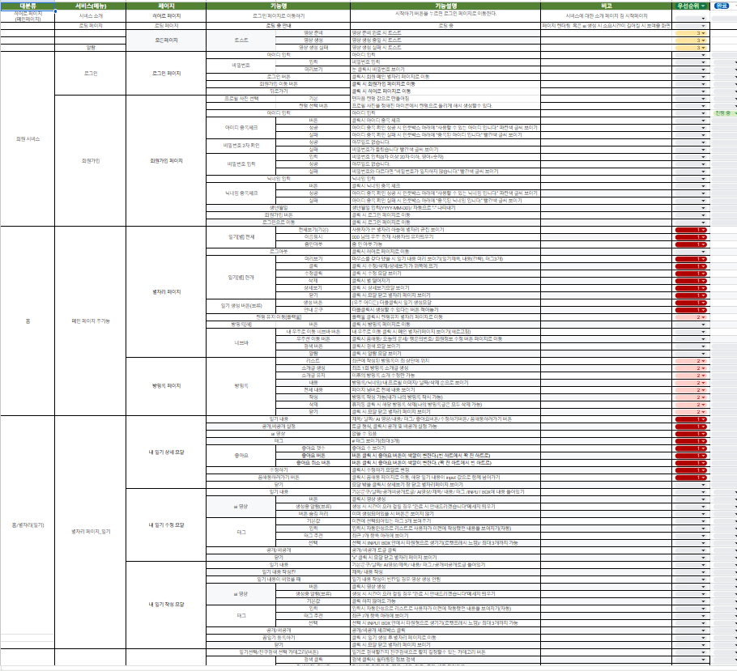

<details>
<summary>2025-03-04</summary>

# 📚오늘의 공부

공부 주제: 거대 언어 모델 (LLM)<br>
공부 자료(책): 랭체인으로 LLM기반의 AI 서비스 개발하기

## 1. GPU (Graphic Processing Unit)

- LLM을 훈련하는 데 필수적인 자원
- 방대한 데이터를 학습시키기 위해 반드시 필요

## 2. GAI와 LLM 비교

- **GAI (Generative AI) 영상 학습**: 영상, 텍스트, 이미지, 음성 데이터 학습 가능
- **LLM (Large Language Model)**: 텍스트 데이터에 국한됨

## 3. LLM의 구성

- 입력층 (Input Layer)
- 은닉층 (Hidden Layer)
- 출력층 (Output Layer)

## 4. LLM의 종류

1. **RNN (Recurrent Neural Network)**
   - 긴 문장 저장 불가능
   - 공간 제약 존재
2. **LSTM (Long Short-Term Memory)**
   - 긴 문장 저장 가능
3. **트랜스포머 (Transformer)**
   - 언어 모델의 혁신
   - BERT/GPT와 같은 모델 사용
   - BERT: 양방향 이해
   - GPT: 전체 문장 생성 중심

## 5. LLM과 SML 비교

- **LLM**: 70억 개 이상의 파라미터
- **SML (Small Language Model)**: 약 70억 개 정도의 파라미터 (예: 기후 데이터, 날씨 예측)

## 6. 프롬프트와 컴플리션

- **프롬프트 (Prompt)**: 입력 질문
- **컴플리션 (Completion)**: 모델이 생성하는 답변

## 7. LLM 학습 과정

1. 데이터 수집 및 준비
   - HTML, PDF 등에서 데이터 수집
   - 노이즈 제거, 중복 제거
   - 토큰화 및 데이터 형식 변경
2. 모델 설계
   - 속도 및 성능 조정
3. 모델 학습
4. 모델 검증
   - 훈련 데이터, 테스트 데이터 활용
5. 배포 및 유지보수

## 8. LLM 활용 방식

1. **API 사용**
   - 이미 구축된 모델을 활용하여 비용 절감
2. **파인튜닝 (Fine-Tuning)**
   - 기존 모델에 추가 학습 진행
   - 전이 학습 (Transfer Learning)
   - 질문/답변 세트 형식의 데이터 필요
3. **RAG (Retrieval-Augmented Generation)**
   - 정보 검색 후 텍스트 생성
4. **퓨샷러닝 (Few-Shot Learning)**
   - 적은 데이터로 학습 가능
5. **제로샷러닝 (Zero-Shot Learning)**
   - 학습 데이터 없이 새로운 데이터 예측
6. **원샷러닝 (One-Shot Learning)**
   - 단 한 개의 데이터로 학습 가능

## 9. LLM의 문제점 및 해결책

- 데이터 의존성, 일반화 문제, 오류 가능성, 개인정보 보호 문제 존재
- **프라이빗 엔드포인트 적용** 필요
  - 인터넷 노출 차단
  - 기업 내부 네트워크에서만 접근 가능
  - 데이터 유출 방지
  - 네트워크 보안 강화 (NSG, 방화벽 적용)
- **Azure OpenAI 활용**으로 보안 강화

## 10. 할루시네이션 예방

- **Temperature 설정: 0**
- **할루시네이션 필터링 적용**

# Retrieval-Augmented Generation (RAG)

## 1. RAG 개요

- 검색을 통해 적절한 정보를 찾고, 이를 기반으로 텍스트 생성

## 2. RAG의 과정

1. 질문 입력 (Query)
2. 검색
3. 유사도 검색
   - 키워드 검색: 의도 및 맥락 파악이 어려울 수 있음
   - 시맨틱 검색 (Semantic Search): 의미와 문맥을 이해하여 더 정확한 결과 도출
4. 랭킹 처리
   - 벡터 변환 후 유사도 평가
   - 검색 결과의 랭킹화 (TF-IDF, 클릭률 반영)

## 3. 임베딩 (Embedding)

- RAG 구현 시 필수 요소
- **임베딩 모델 종류**
  - **Word2Vec**: 단어를 벡터로 변환하는 모델
  - **GloVe**
  - **OpenAI 임베딩 모델**

## 4. 랭체인 (LangChain)

- LLM을 효율적으로 활용하기 위한 프레임워크
- 기본적인 모듈과 가이드 제공
- 임베딩, 유사도 검색, 랭킹 처리 등 다양한 기능 지원

---

</details>

<details>
<summary>2025-03-05</summary>

# 🛠️오늘의 개발

개발 주제: Stable Diffusion 3.5 모델을 활용한 영상 데이터 생성을 위한 데이터 준비

## 방법

1. **Stable Diffusion 3.0 & 3.5 모델 사용**
2. 파인튜닝을 위해 허깅페이스의 Diffusers 사용
3. 파인튜닝을 위한 데이터 https://www.youtube.com/playlist?list=PL6B3937A5D230E335 오픈소스 사용

---

## 과정

### 1. 구글 코랩 환경 설정

1. **구글 코랩 노트북 생성 및 GPU 런타임 활성화**

   - 코랩 메뉴에서 **“런타임” → “런타임 유형 변경” → “하드웨어 가속기”**를 GPU로 선택.

2. **필요한 라이브러리 설치**
   ```sh
   !pip install diffusers transformers accelerate datasets
   !pip install torch torchvision
   ```

---

### 2. 데이터 가공하기

#### 프레임 단위로 분리하기 (OpenCV 활용)

```python
from google.colab import drive
drive.mount('/content/drive')

import cv2
import os

# 디버그: /pjt_ai 폴더 내부 내용 출력
print("디버그: '/pjt_ai' 폴더 내부 내용:")
for item in os.listdir('/content/drive/MyDrive/pjt_ai'):
    print(" -", item)

# 저장할 폴더 경로 설정
output_dir = '/content/drive/MyDrive/pjt_ai/frames_2'

video_path = '/content/drive/MyDrive/pjt_ai/2.mp4'

print(video_path)

# 비디오 파일 열기
vidcap = cv2.VideoCapture(video_path)

# 영상의 FPS 확인 (보통 30fps 등)
fps = vidcap.get(cv2.CAP_PROP_FPS)

# 1초당 1프레임을 추출하기 위해 skip_frames를 FPS로 설정
skip_frames = int(fps)

success, image = vidcap.read()

count = 0
frame_id = 0
while success:
    if frame_id % skip_frames == 0:
        output_path = os.path.join(output_dir, f"frame_{count:04d}.png")
        cv2.imwrite(output_path, image)
        print(f"Saved frame_{count:04d}.png (원본 프레임 번호: {frame_id})")
        count += 1
    success, image = vidcap.read()
    frame_id += 1

print(f"총 {count}개의 프레임이 저장되었습니다.")
```

#### 이미지 전처리 (512×512 크기 조정 및 정규화)

```python
import cv2
import numpy as np

def preprocess_image_cv2(image_path, target_size=(512, 512)):
    # 이미지 읽기 (BGR 포맷)
    image = cv2.imread(image_path)
    if image is None:
        raise ValueError("이미지를 불러올 수 없습니다: " + image_path)

    # BGR -> RGB 변환 (필요한 경우)
    image = cv2.cvtColor(image, cv2.COLOR_BGR2RGB)

    # 이미지 리사이즈: 더 짧은 쪽을 target_size에 맞게 맞춘 후 중앙 크롭
    h, w, _ = image.shape
    target_h, target_w = target_size

    # 스케일 결정: 짧은 쪽을 맞추기 위해
    scale = max(target_h/h, target_w/w)
    new_size = (int(w * scale), int(h * scale))
    resized_image = cv2.resize(image, new_size, interpolation=cv2.INTER_LINEAR)

    # 중앙 크롭
    new_h, new_w, _ = resized_image.shape
    start_x = (new_w - target_w) // 2
    start_y = (new_h - target_h) // 2
    cropped_image = resized_image[start_y:start_y+target_h, start_x:start_x+target_w]

    # 정규화: [0,255] -> [0,1] 범위로 변환 후, 예를 들어 [-1,1]로 스케일링
    normalized_image = cropped_image.astype(np.float32) / 255.0
    normalized_image = (normalized_image - 0.5) / 0.5  # [-1,1] 범위

    return normalized_image

# 입력 및 출력 폴더 설정
input_folder = '/content/drive/MyDrive/pjt_ai/frames'
output_folder = '/content/drive/MyDrive/pjt_ai/data_preprocessing'

# 폴더 내 모든 파일 목록을 순회하며 이미지 파일만 처리
for filename in os.listdir(input_folder):
    if filename.lower().endswith(('.png')):
        file_path = os.path.join(input_folder, filename)

        # 전처리 함수 적용
        processed_img = preprocess_image_cv2(file_path, target_size=(512, 512))
        print(f"{filename} 전처리된 이미지 shape: {processed_img.shape}")

        # (옵션) 전처리된 이미지를 저장하려면 먼저 정규화 해제 ([-1,1] -> [0,255])
        denorm_img = ((processed_img * 0.5) + 0.5) * 255.0
        denorm_img = np.clip(denorm_img, 0, 255).astype(np.uint8)
        # OpenCV는 BGR 포맷을 사용하므로 RGB->BGR 변환
        denorm_img_bgr = cv2.cvtColor(denorm_img, cv2.COLOR_RGB2BGR)

        save_path = os.path.join(output_folder, filename)
        cv2.imwrite(save_path, denorm_img_bgr)

print("전처리 및 저장 완료!")

```

---

### 3. 데이터셋 만들기

#### PyTorch Dataset으로 변환

```python
import os
from PIL import Image
import torch
from torch.utils.data import Dataset
import torchvision.transforms as transforms

class PreprocessedImageDataset(Dataset):
    def __init__(self, folder_path, transform=None):
        """
        folder_path: 전처리된 이미지들이 저장된 폴더 경로
        transform: 이미지에 적용할 변환 함수. 기본적으로 ToTensor()를 사용합니다.
        """
        self.folder_path = folder_path
        # 폴더 내의 이미지 파일 경로 리스트 (PNG, JPG, JPEG 파일)
        self.image_files = [os.path.join(folder_path, f)
                            for f in os.listdir(folder_path)
                            if f.lower().endswith(('.png'))]
        # transform이 지정되지 않으면 기본 transform (이미지를 [0,1] 범위의 텐서로 변환)
        if transform is None:
            self.transform = transforms.Compose([
                transforms.ToTensor()  # PIL 이미지 -> [0,1] 범위의 텐서 (채널, 높이, 너비)
            ])
        else:
            self.transform = transform

    def __len__(self):
        return len(self.image_files)

    def __getitem__(self, idx):
        # 파일 경로 가져오기
        image_path = self.image_files[idx]
        # 이미지 읽기 및 RGB 변환
        image = Image.open(image_path).convert("RGB")
        # 지정된 변환 적용
        image = self.transform(image)
        return image

# 사용_1
dataset_path = '/content/drive/MyDrive/pjt_ai/data_preprocessing'
dataset = PreprocessedImageDataset(dataset_path)
print("데이터셋 길이:", len(dataset))
sample = dataset[0]
print("샘플 이미지 텐서 shape:", sample.shape)

# 사용_2
dataset_path_2 = '/content/drive/MyDrive/pjt_ai/data_preprocessing_2'
dataset_2 = PreprocessedImageDataset(dataset_path_2)
print("데이터셋 길이:", len(dataset_2))
sample_2 = dataset_2[0]
print("샘플 이미지 텐서 shape:", sample_2.shape)
```

---

### 4. 모델 가져오기

Stable Diffusion 3.0 또는 3.5 모델을 불러오고, Diffusers 라이브러리를 활용하여 파인튜닝을 진행.

---

</details>

<details>
<summary>2025-03-06</summary>

# 📄 오늘의 기획

작업 내용: 꿈 기록 서비스 기능명세서 작성 <br>
함께한 팀원: 박주찬

## 기능명세서



### 1. 기능 개요

사용자가 꿈을 기록하고, AI가 이를 영상으로 생성 혹은 꿈 해몽을 제공하는 서비스

### 2. 주요 기능

- **꿈 기록**: 텍스트로 꿈을 입력
- **AI 영상**: 입력된 꿈을 요약하여 AI를 통한 영상 생성
- **꿈 저장 및 관리**: 별자리로 꿈을 조회하고 수정 가능

### 3. 다음 작업

- AI 영상 생성 방식 구체화 및 모델 테스트

</details>

<details>
<summary>2025-03-07</summary>

# 📄 오늘의 기획

## WBS


### 🔹 AI WBS

- AI 관련 작업 일정 조정 및 작업 분배, 디렉터리 구조 선정

### 카테고리별 학습

#### ✅ AI 모델

- SVD large model

#### ✅ 학습 순서

1. **꿈 분류** (중분류 예시: 지상동물)
   - 참고 데이터: [아시아경제 사주·운세](https://www.asiae.co.kr/fortune/dream.htm)
2. **꿈 분류별 데이터 수집** (배경, 분위기 등)
3. **학습 진행**

#### ✅ AI 처리 순서

1. **꿈 텍스트 입력**
2. **키워드 추출 및 프롬프트 생성** (필요 시 한국어 → 영어 번역)
3. **추출한 키워드 기반 영상 선택**
4. **키워드 부적절성 검사** (고려사항 반영)
5. **비디오 생성**

### AI 디렉터리 구조

```jsx
└─app
  ├─config          # 환경설정, API 키 등
  ├─core            # AI 모델 추론 핵심 로직
  │ ├─summarization # 텍스트 요약 모델 및 로직
  │ ├─replacement   # 텍스트 대치 모델 및 로직
  │ ├─keyword       # 키워드 추출 모델 및 로직  ← 추가
  ├─models
  │ ├─request       # 요청 데이터 구조(FAST API)
  │ ├─response      # 응답 데이터 구조(FAST API)
  │ └─keyword       # 키워드 추출 요청 및 응답 구조  ← 추가
  ├─ml_models            # 파인튜닝된 모델 저장 및 관리
  │ ├─checkpoints        # 모델 체크포인트
  │ ├─summary_weights    # 요약 모델 가중치 (세분화)
  │ ├─replacement_weights # 대치 모델 가중치 (세분화)
  │ ├─video_weights      # 영상 생성 모델 가중치
  │ └─keyword_weights    # 키워드 추출 모델 가중치  ← 추가
  ├─notebooks       # 실험 및 분석용 노트북
  ├─routers         # API 엔드포인트
  ├─temp            # 임시 파일 (처리 과정에서만 사용)
  └─.venv
```

</details>
