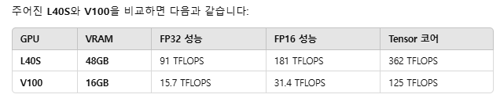

2025-03-10

# 📄 오늘의 기획

## 📝 AI 파인튜닝 모델 로직 전체 수정

### 🔹 비교하기

1. **모델 비교**
2. **영상 시간 비교**
   - 영상 이어붙이기 vs 영상 개별 저장 (2개~3개 저장)

### 🔹 모델 선정을 위한 테스트

#### ✅ 모델 테스트
| 모델   | SVD Large                                                                     | AnimateDiff v3                                | Zeroscope                                              | VideoCrafter2                       |
| ------ | ----------------------------------------------------------------------------- | --------------------------------------------- | ------------------------------------------------------ | ----------------------------------- |
| 해상도 | 정사각형(1:1) (가로로 긴 해상도도 설정 가능, BUT 정사각형에 최적화) ⇒ 512×512 | 다양 (가로로 긴 해상도도 설정 가능) ⇒ 768×384 | 정사각형 (가로로 긴 해상도도 설정 가능, BUT 왜곡 가능) | 다양 (가로로 긴 해상도도 잘 처리함) |
| 사이트 | [Stability AI](https://stability.ai/stable-video)                             |                                               | [Zeroscope](https://zeroscope.replicate.dev/)          |                                     |

---

### 🔹 학습 구조 테스트

#### ✅ 방법 1: 카테고리별 학습

- **학습 순서**

  1. 꿈 분류 (중분류 예시: 지상동물)
     - 참고 데이터: [아시아경제 사주·운세](https://www.asiae.co.kr/fortune/dream.htm)
  2. 꿈 분류별 데이터 수집 (배경, 분위기 등)
  3. 학습 진행

- **AI 처리 순서**
  - 꿈 텍스트 → 키워드 추출을 기반으로 프롬프트 생성 (+ 한국어 → 영어 번역 필요 시) → 추출한 키워드 기반 영상 선택 → 키워드 부적절성 검사 → 비디오 생성

---

#### ✅ 방법 2: 감정별 학습

- **학습 순서**

  1. 감정 분석
  2. 감정별 모델 선택 (감정별 학습시킨 영상을 토대로 영상 생성)

- **AI 처리 순서**
  - 꿈 텍스트 → 감정 분석 → 감정별 영상 모델 선택 → 2개 세그먼트로 분할 (요약 X) → 각 세그먼트 별 주요 키워드 추출 (프롬프트 생성) → 키워드 부적절성 검사 → 세그먼트 별 비디오 생성

---

### 🔹 고려사항

- **부적절한 언어 포함 (폭력, 19금 단어 - 살해, 성적 관련 단어 등)**
  - 영상 정책에 어긋나는 경우 "생성이 불가하다"는 메시지 출력
  - 해당 키워드가 포함되면 즉시 OUT! (일기 생성만 가능)

---

### 🔹 파인튜닝 목적

- **일관된 그림체/스타일로 영상 생성**

---

### 🔹 테스트 환경 설정

#### ✅ **RunPod 사용 이유**

- **GPU 선택 가능성**:
  - RunPod에서는 필요한 VRAM을 가진 GPU 선택 가능 (예: RTX 3090/4090, A5000/A6000)
  - SVD Large 같은 무거운 모델은 24GB 이상의 VRAM 필요
- **세션 안정성**:
  - 여러 모델을 순차적으로 테스트하고 학습시키려면 안정적인 세션 필요
  - RunPod은 Colab Pro보다 세션 안정성이 높음
- **비용 효율성**:
  - 정확한 테스트 기간만큼만 비용 지불 가능
  - 사용하지 않을 때는 비용이 발생하지 않음
- **리소스 일관성**:
  - Colab Pro는 매번 다른 GPU가 할당될 가능성이 있음 → 테스트 결과 일관성 저하
  - RunPod은 동일한 사양의 GPU 유지 가능 → 모델 간 공정한 비교 가능

---

### 🔹 학습이 잘 되었는지 확인

- 특정 감정 또는 카테고리를 학습시킨 후,
  1. 원래 학습시킨 감정/카테고리의 내용을 입력했을 때 첫 번째 모델이 올바르게 작동하는지 확인
  2. 다른 감정/카테고리의 입력이 들어왔을 때도 정상적으로 작동하는지 확인

---

### 🔹 프롬프트를 정제해야 하는 이유

- **키워드 추출**

  - 귀중한 도자기, 회장, 배달, 빈 집, 두고 감, 가짜로 오해됨, CCTV 영상, 가까운 친구들, 배신, 회장의 분노, 처벌, 절망적인 울음, 강렬한 감정

- **요약**
  - 회장님에게 귀중한 도자기를 전달하려 했지만, 가품으로 오해받는 상황 발생.
  - CCTV를 통해 범인이 가까운 친구들임이 밝혀지고, 회장님의 분노로 인해 위기 발생.
  - 나는 친구들을 살려달라고 울며 간청하는 절망적인 상황에서 꿈에서 깨어남.

### 🔹 프롬프트를 정제해야 하는 이유

- **키워드 추출 vs 요약**

  - 요약된 문장은 이야기의 흐름을 이해하는 데 도움이 되지만, AI가 영상화할 때 중요한 요소들이 사라질 수 있음.
  - 반면, 키워드 추출 방식은 핵심적인 장면과 감정을 유지하며, 영상의 주요 요소(장소, 인물, 감정 등)를 더 효과적으로 반영할 수 있음.
  - 예를 들어, *"절망적인 울음"*이나 _"CCTV 영상"_ 같은 키워드는 특정한 영상 장면을 떠올리게 하지만, 요약된 문장에서는 이러한 요소가 사라져 있음.

- **결론**
  - 영상 생성 AI 모델이 보다 생생하고 의미 있는 장면을 만들기 위해서는, 이야기의 단순 요약보다 키워드 추출 방식을 활용하는 것이 더 효과적임.

2025-03-11

# 📌 오늘의 작업

## 📝 꿈 기록 서비스 기능명세서 수정 및 확정

- 기능 추가/수정 및 최종 확정
- 주요 변경 사항 정리

## 📌 WBS 업데이트

### 🔹 프론트엔드 WBS

- 작업 항목 확정 및 기능별 담당자 분배

### 🔹 AI WBS

- AI 관련 작업 일정 조정 및 세부 항목 수정

## 📑 기타 정리 및 문서화

- 최신 WBS 반영
- 기능명세서 및 작업 일정 업데이트

2025-03-12

# 📌 오늘의 작업

## 📝 AI 로직수정 + 전문가 멘토링 ppt 및 질문 정리 + 테스트 모델 찾기

### 🔹 전문가 리뷰
- AI 처리 순서 검토 요청<프로세스 순서>
  1. 꿈 텍스트 입력
  2. 감정 분석
  3. 감정별 적절한 영상 생성 모델 선택
  4. 2개 세그먼트로 분할 (요약 아님)
  5. 각 세그먼트별 주요 키워드 추출 (프롬프트 생성)
  6. 키워드 부적절성 검사 (고려사항 반영)
  7. 세그먼트별 비디오 생성

### 🔹 테스트 모델 찾기
**-고려사항: 제공된 GPU가 제한적**  
  

| 모델   | SVD Large                                                                     | AnimateDiff v3                                | Zeroscope                                              | VideoCrafter2                       |
| ------ | ----------------------------------------------------------------------------- | --------------------------------------------- | ------------------------------------------------------ | ----------------------------------- |
| 해상도 | 정사각형(1:1) (가로로 긴 해상도도 설정 가능, BUT 정사각형에 최적화) ⇒ 512×512 | 다양 (가로로 긴 해상도도 설정 가능) ⇒ 768×384 | 정사각형 (가로로 긴 해상도도 설정 가능, BUT 왜곡 가능) | 다양 (가로로 긴 해상도도 잘 처리함) |
| 사이트 | [Stability AI](https://stability.ai/stable-video)                             |                                               | [Zeroscope](https://zeroscope.replicate.dev/)          |                                     |

| 모델명            | 해상도 | 프레임 수 | 길이 | 최신 업데이트 | 참고 링크 |
|------------------|---------|----------|------|--------------|----------------------------------------------------------------|
| **SVD Large** | 512×512 (정사각형 최적) | 다양한 프레임 지원 | - | 2023.12 | [Stable Video](https://stability.ai/stable-video) |
| **AnimateDiff v3** | 최대 2048×2048 (가로로 긴 해상도 가능) | 14프레임, 25프레임 버전 제공 | 2~4초 | 2024.02 | [AnimateDiff](https://github.com/guoyww/animatediff/?tab=readme-ov-file) |
| **Zeroscope v2_576w** | 576×320 (가로로 긴 해상도) | 최대 64프레임 | 최소 24프레임 (1초) | 8개월 전 | [Zeroscope v2_576w](https://huggingface.co/cerspense/zeroscope_v2_576w) |
| **VideoCrafter2** | 320×512 (가로로 긴 해상도 지원) | 최소 16프레임 (1/24초 기준 약 0.67초) | - | 8개월 전 | [VideoCrafter](https://github.com/AILab-CVC/VideoCrafter) |

2025-03-13

# 📌 오늘의 작업
### 🔹 테스트 모델 찾기

| 모델명             | 해상도                  | 프레임 수 | 길이         | 최신 업데이트 | 참고 링크 |
|-------------------|----------------------|----------|------------|--------------|----------------------------------------------------------------|
| **VideoTuna**    | 720×480 (고정)       | 129 (HunyuanVideo) | 5.4초 | 2주 전 | [VideoTuna GitHub](https://github.com/VideoVerses/VideoTuna) |
| **Mochi1**       | 768×768              | 30 frames/s | 최대 5.4초 | 2달 전 | [Mochi1 GitHub](https://github.com/genmoai/mochi) |
| **CogVideoX-2b** | 768×512              | 8 frames/s | 최대 6초 | 지난주, 4달 전 | [CogVideoX-2b Hugging Face](https://huggingface.co/THUDM/CogVideoX-2b) |
| **OpenSora**     | 480P, 720P, 853×480  | -        | -          | 2024.11 | [OpenSora Hugging Face](https://huggingface.co/hpcai-tech/Open-Sora-v2) |
| **LTX Video**    | LTX-VideoQ8 (8비트 버전) 720×480×121 생성 가능 | - | - | 2024.12.24 | [LTX Video GitHub](https://github.com/Lightricks/LTX-Video) |
| **Wan**          | 832x480              | -        | -          | 2024.10.22 | [Wan Hugging Face](https://huggingface.co/Wan-AI/Wan2.1-T2V-14B) |

# 📚 오늘의 공부

### **LoRA의 기본 개념**

- LoRA는 **모델의 전체 파라미터를 직접 업데이트하지 않고, 특정 행렬(2차원 텐서)의 저차원 근사값을 학습하는 방식
- 주로 Transformer 모델에서 가중치 행렬(W)에 대한 저차원 보정값(ΔW)만 추가 학습하여 파라미터 수를 줄이고, 학습 속도를 높임

#### LoRA를 Text-to-Video 모델에 적용할 수 있을까? 

- LoRA는 원래 언어 모델(LLM)에 적용되었지만, 영상 생성 모델(Stable Diffusion, LTX-Video 등)에도 활용 가능
- LoRA가 조정하는 것은 모델의 가중치 행렬(2D 텐서)
- 영상 생성 모델(예: Stable Diffusion 기반 Video 모델)도 U-Net, Transformer, Cross-Attention 등의 행렬 연산을 수행
- 즉, 영상 모델에서도 특정 계층(특히 Cross-Attention Layer)을 LoRA로 미세 조정할 수 있음

#### 영상 데이터는 3차원인데, LoRA는 2차원? 괜찮을까?

- 영상 자체는 (T, H, W, C) = 4차원 텐서
- 하지만 영상 생성 모델의 내부 연산은 주로 행렬 연산(2D 텐서)으로 진행됨
- LoRA는 이러한 연산 과정에서 2D 가중치 행렬을 업데이트하는 방식이므로 문제없음
- Stable Diffusion 기반의 영상 모델들도 LoRA를 사용해 파인튜닝 가능

### **데이터 전처리**

- 영상을 초당 프레임으로 자르기(보통은 24-36이 좋음, 특히 동작이 중요한 경우 프레임 수를 높이는게 좋음)
- openCV에 저장은 RGB값으로 저장되기 때문에 BGR -> RGB로 ㅂ변환하기
- 3차원 텐서로 변환(이미지 및 영상은 3차원 텐서, 벡터는 1차원텐서, 행렬은 2차원 텐서)

2025-03-14

# 📌 오늘의 작업

## 📝 AI 구현 대안책 계획

#### 대안 1 
1. 사용자 텍스트 입력
2. chat-gpt를 통한 키워드 추출 
3. LLM 파인튜닝을 통한 불순한 언어 필터링
4. 필터링된 키워드를 통해 영상 생성(GEN-3 모델 API 활용)

#### 대안 2
1. 사용자 텍스트 입력
2. Chat-gpt를 통한 사용자 키워드 추출
3. midjourney로 텍스트 이미지 뽑아내기
4. runway(gen-3)로 이미지를 영상으로 뽑아내기

## 데이터 찾기 
1. 동일한 그림체를 위해 투니버스 영상 고려 (한 그림체에 모든 감정영상이 들어있음)
2. 감정별 영상 찾기(유튜브_심청영상(공포))

