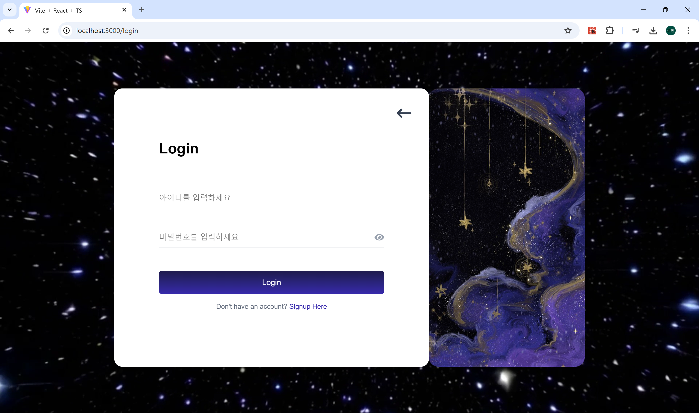
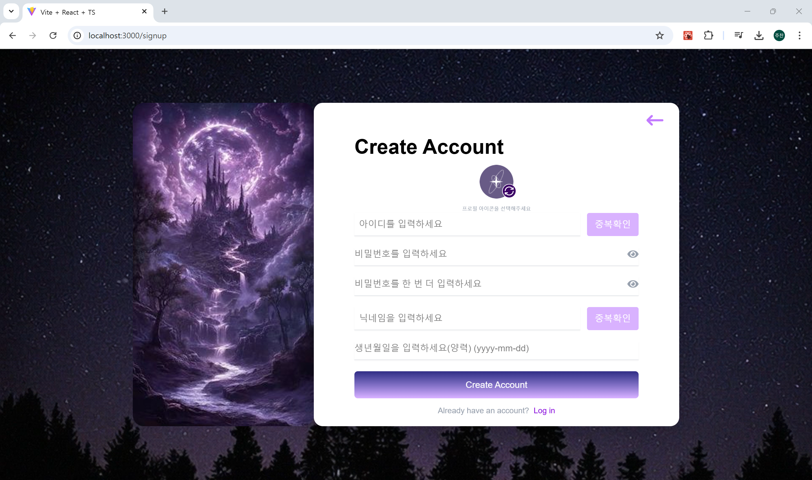
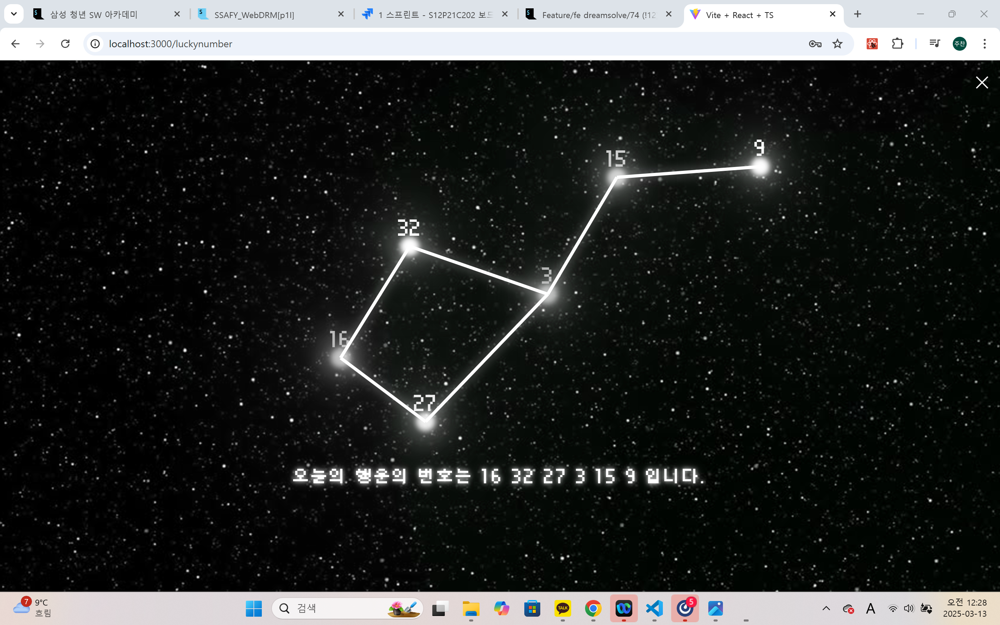
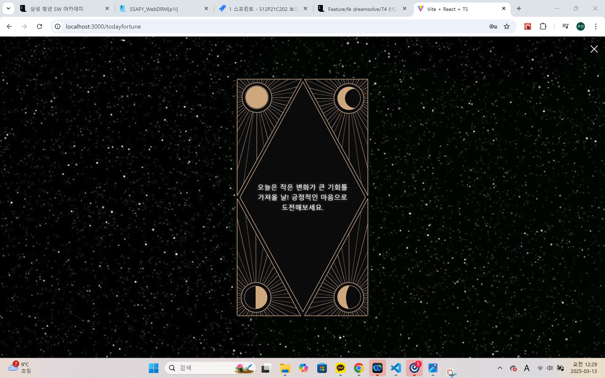
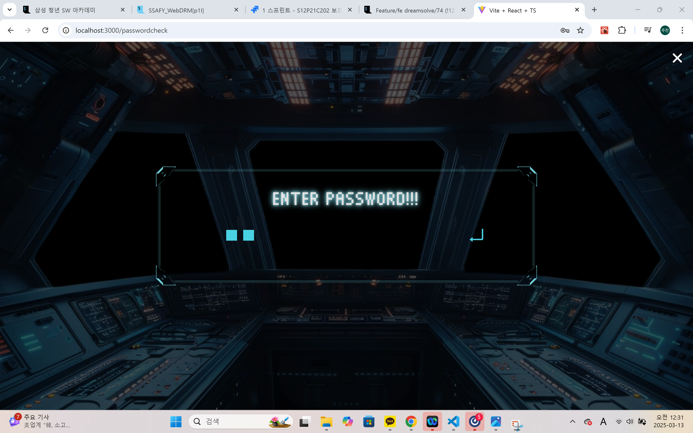
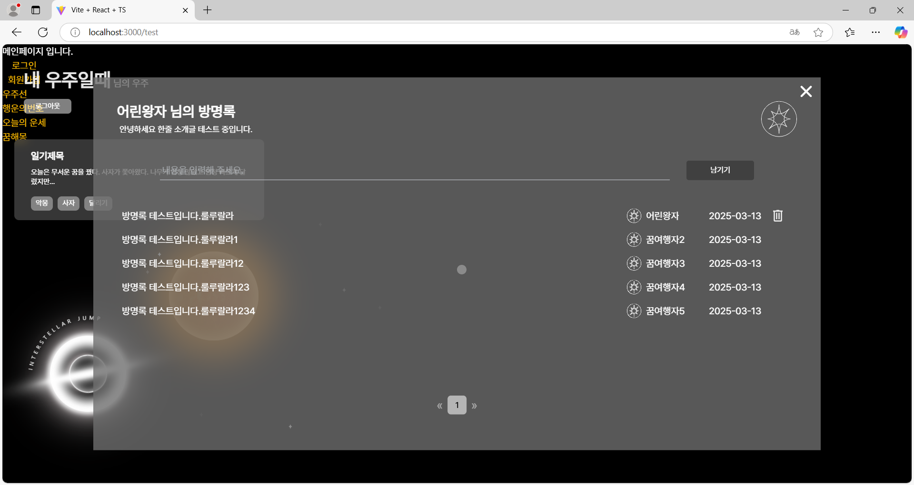
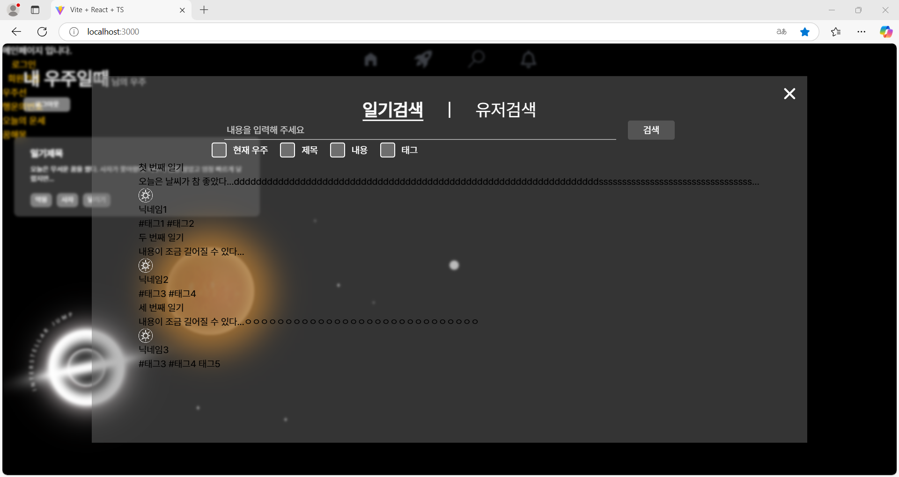

<details>
    <summary>2025-03-10</summary>

# 배포 순서 연습

1. mobaxterm 실행
2. 왼쪽 상단 Session 버튼 클릭
3. SSH 선택
4. Remote host: 싸피에서 주는 주소 공통떄는 i12C201.p.ssafy.io
5. Specify 체크 Username: 공통 때는 ubuntu
6. port 22
7. Advanced SSH settings 체크하고 저장한 펨키를 넣어준다.
8. ok 클릭
9. GUI에 ssh -i 로 시작하는 싸피에서주어지는 거 입력
10. 서버 업데이트 및 기본도구 설치

```
sudo apt update
sudo apt upgrade -y
sudo apt install -y apt-transport-https ca-certificates curl software-properties-common
```

11. Docker 설치

```
# Docker 설치
curl -fsSL https://download.docker.com/linux/ubuntu/gpg | sudo apt-key add -
sudo add-apt-repository "deb [arch=amd64] https://download.docker.com/linux/ubuntu $(lsb_release -cs) stable"
sudo apt update
sudo apt install -y docker-ce
sudo usermod -aG docker $USER

# Docker 서비스 시작 및 자동 시작 설정
sudo systemctl start docker
sudo systemctl enable docker

sudo usermod -aG docker $USER
docker run hello-world
```

12. Kubectl 설치

```
curl -LO "https://dl.k8s.io/release/$(curl -L -s https://dl.k8s.io/release/stable.txt)/bin/linux/amd64/kubectl"
chmod +x kubectl
sudo mv kubectl /usr/local/bin/
```

13. eksctl

```
curl --silent --location "https://github.com/weaveworks/eksctl/releases/latest/download/eksctl_$(uname -s)_amd64.tar.gz" | tar xz -C /tmp
sudo mv /tmp/eksctl /usr/local/bin
```

14. AWS CLI 설치

```
curl "https://awscli.amazonaws.com/awscli-exe-linux-x86_64.zip" -o "awscliv2.zip"
sudo apt install -y unzip
unzip awscliv2.zip
sudo ./aws/install
```

15. AWS 자격 증명 구성

```
aws configure
```

후에는 EKS 클러스터 생성 할 예정!

</details>

<details>
    <summary>2025-03-11</summary>

# 1. 로그인 페이지 디자인



# 2. 회원가입 페이지 디자인



# 3. 우주선 페이지 디자인


</details>

<details>
    <summary>2025-03-12</summary>

# 1. 꿈해몽



# 2. 오늘의 운세



# 3. 꿈해몽


# 4. 꿈해몽2


# 5. 비밀번호 체크



</details>

<details>
    <summary>2025-03-13</summary>

# 1. 방명록 모달 완성



# 2. 검색 모달창 제작 중



</details>
