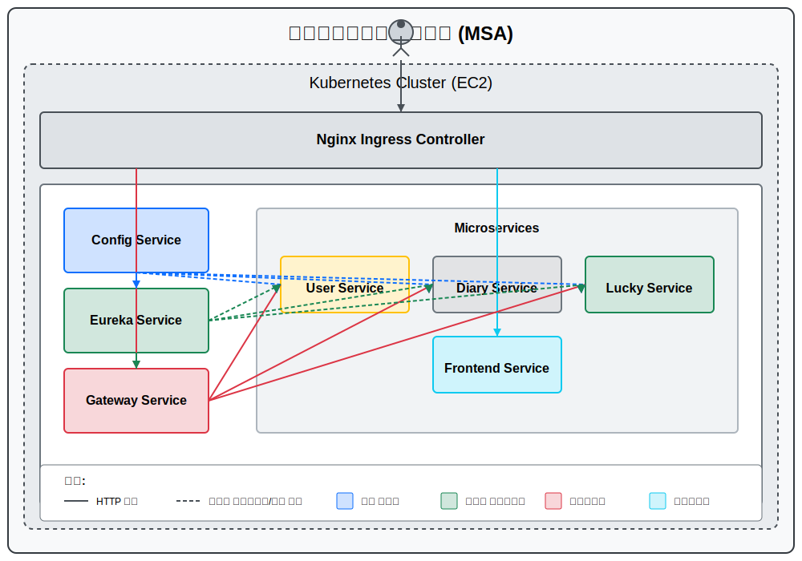

<details>
    <summary>2025-03-17</summary>

# 1. 현재 Msa 방식으로 배포를 진행 중입니다.



- k3s를 이용하여 배포를 진행 도중 ks3 자체 ip 주소를 이용하는 treafic과 nginx ingress 와 충돌하는 것을 약 10시간만에 깨닫게 되었습니다...!

# 2. 그래서 현재 프론트파일을 도커 허브에 업로드 해놓았고 그 이미지를 pull 받아서 띄우는 형태를 구성하려고 하였으나 충돌로 인하여 k3s -> 바닐라 쿠바네티스를 이용하고자 하였습니다.

# 쿠버네티스 기반 마이크로서비스 아키텍처 설정 진행상황

## 완료된 작업

### 1. k3s 제거 및 바닐라 쿠버네티스 설치

```bash
# K3S 제거
/usr/local/bin/k3s-uninstall.sh

# 쿠버네티스 구성요소 설치
sudo apt-get update
sudo apt-get install -y apt-transport-https ca-certificates curl
curl -fsSL https://pkgs.k8s.io/core:/stable:/v1.28/deb/Release.key | sudo gpg --dearmor -o /etc/apt/keyrings/kubernetes-apt-keyring.gpg
echo 'deb [signed-by=/etc/apt/keyrings/kubernetes-apt-keyring.gpg] https://pkgs.k8s.io/core:/stable:/v1.28/deb/ /' | sudo tee /etc/apt/sources.list.d/kubernetes.list
sudo apt-get update
sudo apt-get install -y kubelet kubeadm kubectl
sudo apt-mark hold kubelet kubeadm kubectl

```

### 2. 시스템 설정

```bash
# swap 비활성화 (Kubernetes 요구사항)
sudo swapoff -a
sudo sed -i '/ swap / s/^\(.*\)$/#\1/g' /etc/fstab

# 필요한 커널 모듈 활성화
cat <<EOF | sudo tee /etc/modules-load.d/k8s.conf
overlay
br_netfilter
EOF
sudo modprobe overlay
sudo modprobe br_netfilter

# 필요한 sysctl 파라미터 설정
cat <<EOF | sudo tee /etc/sysctl.d/k8s.conf
net.bridge.bridge-nf-call-iptables  = 1
net.bridge.bridge-nf-call-ip6tables = 1
net.ipv4.ip_forward                 = 1
EOF
sudo sysctl --system

```

### 3. Containerd 설정

```bash
# containerd 설정
sudo mkdir -p /etc/containerd
sudo containerd config default | sudo tee /etc/containerd/config.toml
sudo sed -i 's/SystemdCgroup \= false/SystemdCgroup \= true/g' /etc/containerd/config.toml
sudo systemctl restart containerd
sudo systemctl enable containerd

# Docker 설정 조정 (containerd와 호환되도록)
sudo mkdir -p /etc/docker
cat <<EOF | sudo tee /etc/docker/daemon.json
{
  "exec-opts": ["native.cgroupdriver=systemd"],
  "log-driver": "json-file",
  "log-opts": {
    "max-size": "100m"
  },
  "storage-driver": "overlay2"
}
EOF
sudo systemctl restart docker

```

### 4. 쿠버네티스 클러스터 초기화

```bash
# 쿠버네티스 클러스터 초기화
sudo kubeadm init --pod-network-cidr=10.244.0.0/16

# kubeconfig 설정
mkdir -p $HOME/.kube
sudo cp -i /etc/kubernetes/admin.conf $HOME/.kube/config
sudo chown $(id -u):$(id -g) $HOME/.kube/config

```

### 5. 네트워크 및 인그레스 설정

```bash
# Calico CNI 설치
kubectl apply -f https://raw.githubusercontent.com/projectcalico/calico/v3.26.1/manifests/calico.yaml

# 단일 노드 클러스터에서 워크로드 실행 허용
kubectl taint nodes --all node-role.kubernetes.io/control-plane-

# kubectl 경로 문제 해결
sudo ln -s /usr/bin/kubectl /usr/local/bin/kubectl
echo 'export PATH=$PATH:/usr/bin' >> ~/.bashrc
source ~/.bashrc

# Nginx Ingress Controller 설치
kubectl apply -f https://raw.githubusercontent.com/kubernetes/ingress-nginx/controller-v1.9.4/deploy/static/provider/cloud/deploy.yaml

```

### 6. SSL 인증서 관리 설정

```bash
# cert-manager 설치
kubectl apply -f https://github.com/cert-manager/cert-manager/releases/download/v1.12.0/cert-manager.yaml

# ClusterIssuer 설정 (Let's Encrypt)
cat > cluster-issuer.yaml << EOF
apiVersion: cert-manager.io/v1
kind: ClusterIssuer
metadata:
  name: letsencrypt-prod
spec:
  acme:
    server: https://acme-v02.api.letsencrypt.org/directory
    email: p990805@gmail.com
    privateKeySecretRef:
      name: letsencrypt-prod
    solvers:
    - http01:
        ingress:
          class: nginx
EOF
kubectl apply -f cluster-issuer.yaml

```

### 7. 마이크로서비스 네임스페이스 생성

```bash
# 마이크로서비스 네임스페이스 생성
kubectl create namespace msa-system
kubectl create namespace user-service
kubectl create namespace lucky-service
kubectl create namespace gateway-service
kubectl create namespace eureka-service
kubectl create namespace diary-service
kubectl create namespace config-service
kubectl create namespace frontend-service

```

## 남은 작업

1. 각 마이크로서비스의 Dockerfile 작성
2. 각 마이크로서비스 Docker 이미지 빌드 및 Docker Hub에 푸시
3. 각 마이크로서비스의 Deployment, Service, Ingress 설정 및 배포
4. 전체 시스템 연동 테스트

## 프로젝트 구성

### 마이크로서비스 구성

- Config Service: 중앙 설정 관리 (Spring Cloud Config)
- Eureka Service: 서비스 디스커버리
- Gateway Service: API 게이트웨이
- User Service: 사용자 관리
- Diary Service: 다이어리 기능
- Lucky Service: 운세 서비스
- Frontend Service: React 기반 프론트엔드

### 프로젝트 폴더 구조

```
project-root/
│
├── BE/
│   ├── config-service/
│   │   ├── src/
│   │   ├── Dockerfile  # 아직 작성 필요
│   │   └── pom.xml
│   │
│   ├── eureka-service/
│   │   ├── src/
│   │   ├── Dockerfile  # 아직 작성 필요
│   │   └── pom.xml
│   │
│   ├── gateway-service/
│   │   ├── src/
│   │   ├── Dockerfile  # 아직 작성 필요
│   │   └── pom.xml
│   │
│   ├── user-service/
│   │   ├── src/
│   │   ├── Dockerfile  # 아직 작성 필요
│   │   └── pom.xml
│   │
│   ├── diary-service/
│   │   ├── src/
│   │   ├── Dockerfile  # 아직 작성 필요
│   │   └── pom.xml
│   │
│   └── lucky-service/
│       ├── src/
│       ├── Dockerfile  # 아직 작성 필요
│       └── pom.xml
│
└── FE/
    └── frontend-service/
        ├── src/
        ├── Dockerfile  # Frontend만 작성 완료
        └── package.json

```

</details>

<details>
  <summary>2025-03-18</summary>

# 쿠버네티스로 고통 받다가 도커 컴포즈로 변경

# ec2 초기화 했습니다.

# 1. 설정 초기화

```docker
# 시스템 패키지 업데이트
sudo apt update
sudo apt upgrade -y
```

# 2. 기본 유틸리티 설정

```docker
# 기본 유틸리티 설치
sudo apt install -y git curl wget vim htop
```

# 3. UFW 허용번호 확인

```powershell

# UFW 상태 확인
sudo ufw status numbered

#대충이런식으로나옴
ubuntu@ip-172-26-14-197:~$ sudo ufw status numbered
Status: active
     To                         Action      From
     --                         ------      ----
[ 1] 22                         ALLOW IN    Anywhere
[ 2] 80                         ALLOW IN    Anywhere
[ 3] 44                         ALLOW IN    Anywhere
[ 4] 8989                       ALLOW IN    Anywhere
[ 5] 22 (v6)                    ALLOW IN    Anywhere (v6)
[ 6] 80 (v6)                    ALLOW IN    Anywhere (v6)
[ 7] 44 (v6)                    ALLOW IN    Anywhere (v6)
[ 8] 8989 (v6)                  ALLOW IN    Anywhere (v6)
ubuntu@ip-172-26-14-197:~$ ls -la ~/ | grep .ssh
drwx------ 2 ubuntu ubuntu 4096 Mar 18 05:48 .ssh
drwx------ 2 ubuntu ubuntu 4096 Mar 18 05:48 .ssh_bak
ubuntu@ip-172-26-14-197:~$
```

# 4. Docker 설치

```powershell
# 필요한 패키지 설치
sudo apt update
sudo apt install -y apt-transport-https ca-certificates curl software-properties-common

# Docker 공식 GPG 키 추가
curl -fsSL https://download.docker.com/linux/ubuntu/gpg | sudo apt-key add -

# Docker 저장소 추가
sudo add-apt-repository "deb [arch=amd64] https://download.docker.com/linux/ubuntu $(lsb_release -cs) stable"

# 패키지 정보 업데이트
sudo apt update

# Docker 설치
sudo apt install -y docker-ce

# Docker 서비스 상태 확인
sudo systemctl status docker

# 현재 사용자를 docker 그룹에 추가 (sudo 없이 docker 명령어 실행 가능)
sudo usermod -aG docker $USER
```

# 5. Docker Compose 설치

```powershell
# Docker Compose 최신 버전 설치
sudo curl -L "https://github.com/docker/compose/releases/download/v2.23.0/docker-compose-$(uname -s)-$(uname -m)" -o /usr/local/bin/docker-compose

# 실행 권한 부여
sudo chmod +x /usr/local/bin/docker-compose

# 버전 확인
docker-compose --version

# 로그아웃 후 다시 로그인하거나, 다음 명령어로 현재 세션에 그룹 변경 적용
newgrp docker
```

# 6. 도커와 도커 컴포즈 설치 확인

```powershell
docker-compose --version
# Hello World 컨테이너 실행 테스트
docker run hello-world
```

# 7. 각 프로젝트 마다 도커파일 생성

- 아래와 방법으로 할거면 spring은 mvn clean package 로 빌드 먼저해야함

```powershell
#스프링 예시
FROM openjdk:21
WORKDIR /app
COPY target/*.jar config-service.jar
EXPOSE 8888
ENTRYPOINT ["java", "-jar", "config-service.jar"]
```

```powershell
# 프론트 예시
FROM node:18-alpine AS build
WORKDIR /app
COPY package.json package-lock.json* ./
RUN npm ci
COPY . .
RUN npm run build

FROM nginx:alpine
COPY --from=build /app/dist /usr/share/nginx/html
COPY ./nginx.conf /etc/nginx/conf.d/default.conf
EXPOSE 80
CMD ["nginx", "-g", "daemon off;"]
```

# 8. 프론트 프로젝트 dockerfile이랑 같은 위치에 Nginx.conf 파일 생성

```powershell
server {
    listen 80;

    location / {
        root /usr/share/nginx/html;
        index index.html index.htm;
        try_files $uri $uri/ /index.html;
    }

    # 백엔드 API 요청 프록시
    location /api {
        proxy_pass http://gateway-service:8080;
        proxy_set_header Host $host;
        proxy_set_header X-Real-IP $remote_addr;
        proxy_set_header X-Forwarded-For $proxy_add_x_forwarded_for;
    }
}
```

# 9. 프로젝트 제일 루트 디렉토리에 Docker compose 파일 구성

- docker-compose.yml

```powershell
version: '3'

services:
  config-service:
    image: imjuchan/config-service:latest
    ports:
      - "8888:8888"
    networks:
      - backend-network

  eureka-service:
    image: imjuchan/eureka-service:latest
    ports:
      - "8761:8761"
    depends_on:
      - config-service
    networks:
      - backend-network
    environment:
      - SPRING_CLOUD_CONFIG_URI=http://config-service:8888

  gateway-service:
    image: imjuchan/gateway-service:latest
    ports:
      - "8080:8080"
    depends_on:
      - eureka-service
    networks:
      - backend-network
      - frontend-network
    environment:
      - SPRING_CONFIG_IMPORT=configserver:http://config-service:8888
      - SPRING_CLOUD_CONFIG_URI=http://config-service:8888
      - SPRING_CLOUD_CONFIG_FAIL_FAST=false
      - EUREKA_CLIENT_SERVICEURL_DEFAULTZONE=http://eureka-service:8761/eureka/

  frontend:
    image: imjuchan/frontend-service:latest
    ports:
      - "80:80"
      - "443:443"
    depends_on:
      - gateway-service
    networks:
      - frontend-network
    volumes:
      -  /etc/letsencrypt:/etc/letsencrypt:ro
      - ./nginx-ssl.conf:/etc/nginx/conf.d/default.conf
  # 나머지 서비스들 추가 (user-service, diary-service, lucky-service 등)

networks:
  backend-network:
    driver: bridge
  frontend-network:
    driver: bridge

```

# 10. ec2 들어와서 테스트

```powershell

docker-compose up -d
docker-compose ps
docker-compose logs -f [서비스명]

docker-compose logs -f config-service
docker-compose logs -f eureka-service
docker-compose logs -f gateway-service
docker-compose logs -f frontend
```

# 11. ec2에서 docker-compose.yml 생성

```powershell

# docker-compose.yml 파일 생성 및 편집
nano docker-compose.yml
```

# 12. ec2에서 docker-compose.yml 파일 작성

- 위에서 작성했떤 docker-compose.yml 파일 그대로 가져와서 써도 됌
- ctrl+o 저장
- 엔터
- ctrl+x 나가기

# 13. ec2에서 확인

```powershell
docker compose up -d
docker compose ps
docker compose logs -f
```

- 여기까지 하면 http 배포는 끝

# 14. https 설정

- Let’s Encrypt 로 무료 SSL 인증서 발급

```powershell
sudo apt-get update
sudo apt-get install certbot python3-certbot-nginx
sudo certbot --nginx -d j12c202.p.ssafy.io
```

# 15. nginx 설정

- docker-compose.yml 파일과 같은 위치

```powershell
# EC2 서버에서 nginx-ssl.conf 파일 생성
cat > nginx-ssl.conf << EOF
server {
    listen 80;
    server_name j12c202.p.ssafy.io;
    return 301 https://$host$request_uri;
}

server {
    listen 443 ssl;
    server_name j12c202.p.ssafy.io;

    ssl_certificate /etc/letsencrypt/live/j12c202.p.ssafy.io/fullchain.pem;
    ssl_certificate_key /etc/letsencrypt/live/j12c202.p.ssafy.io/privkey.pem;

    ssl_protocols TLSv1.2 TLSv1.3;
    ssl_prefer_server_ciphers on;
    ssl_ciphers 'EECDH+AESGCM:EDH+AESGCM:AES256+EECDH:AES256+EDH';

    location / {
        root /usr/share/nginx/html;
        index index.html index.htm;
        try_files $uri $uri/ /index.html;
    }

    location /api {
        proxy_pass http://gateway-service:8080;
        proxy_set_header Host $host;
        proxy_set_header X-Real-IP $remote_addr;
        proxy_set_header X-Forwarded-For $proxy_add_x_forwarded_for;
        proxy_set_header X-Forwarded-Proto $scheme;
    }
}
EOF
```

- 사실 이거 끝나고 docker-compose.yml 에 추가해야할 내용있는데 귀찮아서 위에 올릴때 한꺼번에 올림

```powershell
frontend:
  image: imjuchan/frontend-service:latest
  ports:
    - "80:80"
    - "443:443"  # HTTPS 포트 추가
  depends_on:
    - gateway-service
  networks:
    - frontend-network
  volumes:
    - /etc/letsencrypt:/etc/letsencrypt:ro  # 인증서 디렉토리 마운트
    - ./nginx-ssl.conf:/etc/nginx/conf.d/default.conf  # Nginx 설정 파일 마운트
```

# 16. 도커 적용

```powershell
# 기존 컨테이너 중지
docker compose down

# 새 설정으로 컨테이너 시작
docker compose up -d
```

# 17.certbot 설치

```powershell
sudo apt-get update
sudo apt-get install certbot

docker compose down

certbot --version
sudo certbot certonly --standalone -d j12c202.p.ssafy.io

docker compose up -d
```

- 인증서 발급 과정에서 일시적으로 80번 포트를 사용함으로 잠시 도커를 꺼놈
- 그리고 다시 키기

# 18. ec2에 젠킨스 설치

```powershell
# Jenkins 저장소 키 가져오기
sudo wget -O /usr/share/keyrings/jenkins-keyring.asc \
  https://pkg.jenkins.io/debian-stable/jenkins.io-2023.key

# Jenkins 저장소 추가
echo deb [signed-by=/usr/share/keyrings/jenkins-keyring.asc] \
  https://pkg.jenkins.io/debian-stable binary/ | sudo tee \
  /etc/apt/sources.list.d/jenkins.list > /dev/null

# 패키지 목록 업데이트
sudo apt-get update

# Jenkins 설치 전 Java 설치 (Jenkins는 Java 기반)
sudo apt-get install -y openjdk-17-jdk

# Jenkins 설치
sudo apt-get install -y jenkins

# Jenkins 서비스 시작
sudo systemctl start jenkins

# Jenkins 서비스 상태 확인
sudo systemctl status jenkins
```

# 19. 젠킨스 설정

```powershell
관리자 비밀번호 확인해야함
sudo cat /var/lib/jenkins/secrets/initialAdminPassword
```

- 이때 젠킨스는 8080 쓰기 때문에 아까 ufw에서 8080 허용되고 있는지 확인

```powershell
sudo ufw status numbered
sudo ufw allow 8080
sudo ufw status numbered

```

# 20. 젠킨스 가입

- 가입되면 http://j12c202.p.ssafy.io:8080에 들어가서 가입하기

# 21. 플러그인 설치

- 관리 들어가서 플러그인 관리 들어가기
-

GitLab
GitLab API
Docker
Docer pipeline

이거 선택 하기

- 설치 후 재시작

# 22. 깃랩과 도커 accesstoken 얻기

```powershell
https://claude.ai/chat/24c29839-5423-4a8c-8338-d4379ca43a8a
```

# 23. accesstoken얻은거 젠킨스랑 연동하기

```powershell
https://claude.ai/chat/004eee28-fa0d-4e4b-b6ee-8ea80145d0f8
```

</details>
