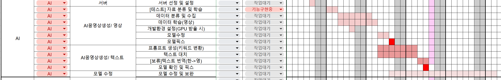

<details>
<summary><b>2025-03-10</b></summary>

<div markdown="1">

# huggingface 둘러보기

`stable video diffusion` 모델을 파인튜닝 시키기 위해 마음에 드는 3d 애니메이션을 찾아보았다.

# AI WBS 작성

- 일정을 체계적으로 짜는 법을 배우고, 이를 통해 눈에 보이는 계획이 있으니 일정을 맞춰 개발을 나아가야겠다는 다짐을 했다.
  

</div>
</details>

<details>
<summary><b>2025-03-11</b></summary>

<div markdown="1">

# FE(React) 초기 설정

## tsconfig.json 옵션 설정

- https://typescript-kr.github.io/pages/tsconfig.json.html

```
{
  "compilerOptions": {
    "allowJs": true, // js, jsx 파일(ES6)을 포함함
    "outDir": "./bulid/", // 트랜스파일 결과물 저장할 경로
    "esModuleInterop": true, // commonJS로 작성한 모듈을 불러올 때 문제 발생될 수 있는데 호환성을 제공해서 문제를 해결해줌
    "forceConsistentCasingInFileNames": true,
    "strict": true,
    "noImplicitAny": true, // 타입스크립트에서 Any와 같은 암시적 데이터 타입을 사용하지 않는다.
    "skipLibCheck": true,
    "resolveJsonModule": true, // 확장자가 .json을 자바스크립트 객체로 임포트할 수 있게 해줌
    "sourceMap": true, // 디버깅을 위한 소스맵 파일을 만들어줌(실행은 ES5로 하지만 디버깅은 TS로 하기 때문에 소스맵이 필요함)
    "module": "commonjs", // target 속성과 관련됨, "target" 속성이 es6이상이면 es6로 바꿔주기
    "target": "es5",
    "jsx": "react" // 컴파일러 옵션
  },
  "include": ["./src/**/*"], // 트랜스파일 할 파일 경로 설정(src아래 모든 파일)
  "exclude": ["node_modules", "**/*.spec.ts"] // 트랜스파일을 제외할 파일 경로 설정
}
```

</div>
</details>

<details>
<summary><b>2025-03-12</b></summary>

<div markdown="1">

# text-to-video 모델 비교1

| 모델                 | SVD Large(이미지 생성시 가능)                 | AnimateDiff v3                                            | Zeroscope v2_576w                                  | VideoCrafter2                             |
| -------------------- | --------------------------------------------- | --------------------------------------------------------- | -------------------------------------------------- | ----------------------------------------- |
| 해상도               | 512×512                                       | 2048x2048 <br> 까지도 가능                                | 576\*320 <br> 30frames 7.9gb                       | 320x512                                   |
| 마지막 <br> 업데이트 |                                               | 2023.12 <br> 깃허브: 8개월 전                             |                                                    | 2024.02 <br> 깃허브: 8개월 전             |
| 최대 프레임(초)      | 2-4초 길이 <br> 14프레임과 25프레임 버전 제공 | 최대 64프레임                                             | 최소 24                                            | 16                                        |
| 사이트               | https://stability.ai/stable-video             | https://github.com/guoyww/animatediff/?tab=readme-ov-file | https://huggingface.co/cerspense/zeroscope_v2_576w | https://github.com/AILab-CVC/VideoCrafter |

</div>
</details>

<details>
<summary><b>2025-03-13</b></summary>

<div markdown="1">

# 내용

| 제목 셀1 | 제목 셀2 | 제목 셀3 | 제목 셀4             |
| -------- | -------- | -------- | -------------------- |
| 내용 1   | 내용 2   | 내용 3   | 내용 4               |
| 내용 5   | 내용 6   | 내용 7   | 내용 8               |
| 내용 9   | 내용 10  | 내용 11  | 내용 12 <br> 내용 13 |

</div>
</details>

<details>
<summary><b>2025-03-14</b></summary>

<div markdown="1">

# 내용

</div>
</details>
