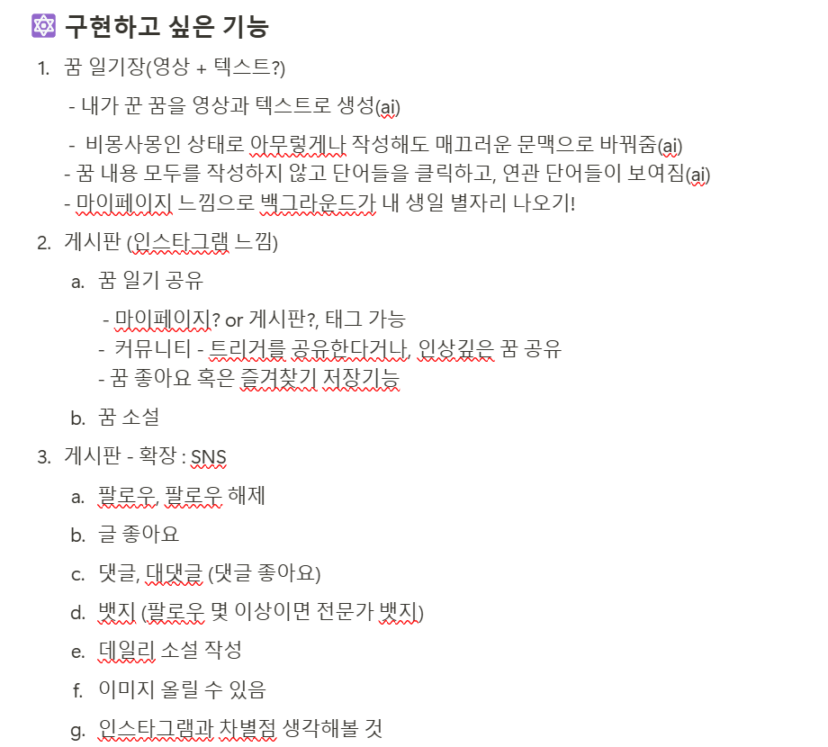
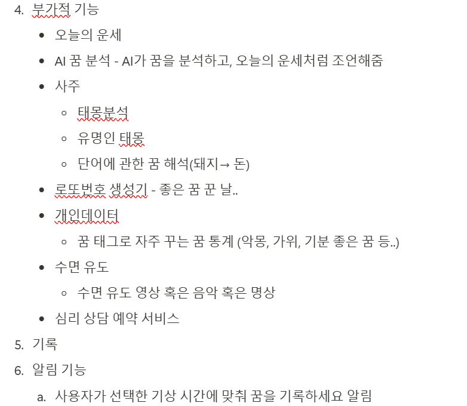
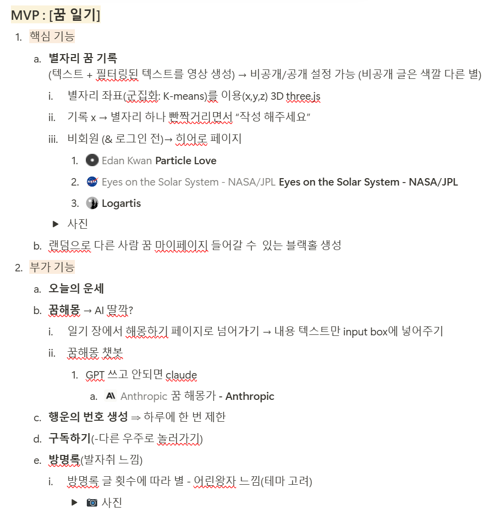
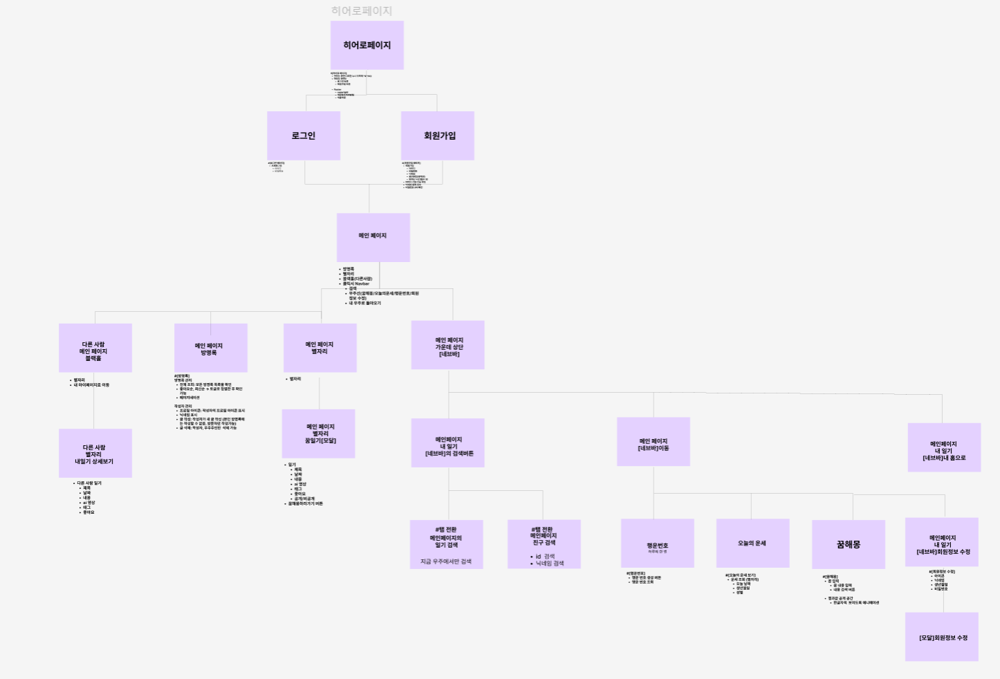
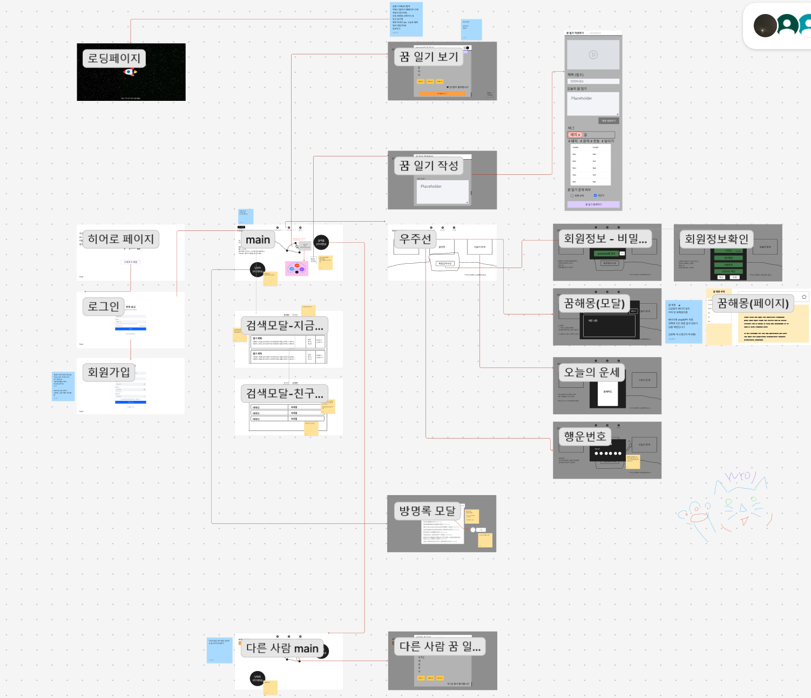

<b>2025-03-04</b>

# 아이디어 기획

- 주제 구체화 : 인상깊은 꿈을 기록하고, 영상을 생성해 내 꿈을 다시 볼 수 있게 만드는 플랫폼

## 맡은 일

### 1️⃣ 기대효과를 뒷받침할 자료(논문) 찾기

1. 꿈이 창의적 문제 해결 능력을 향상시킬 수 있다. 특히 꿈 기록은 창의적 사고를 자극하는 데 중요한 역할
   - https://www.researchgate.net/publication/265122910_The_Committee_of_Sleep_How_Artists_Scientists_and_Athletes_Use_Dreams_for_Creative_Problem-Solving
2. 정기적으로 꿈을 기록하는 사람들이 꿈을 더 잘 기억하며, 이는 전반적인 기억력 향상에도 도움이 됨
   - https://www.researchgate.net/publication/237702923_Entry_and_Ineciency_in_the_Real_Estate_Brokerage_Industry_Empirical_Evidence_and_Policy_Implications
3. 꿈 기록과 분석이 정서적 웰빙에 긍정적인 영향을 미친다고 보고. 특히 악몽을 기록하고 이를 분석하는 과정이 불안을 줄이고 감정을 처리하는 데 도움을 줄 수 있음.
   - https://pubmed.ncbi.nlm.nih.gov/15325742/

### 2️⃣ 구현하고 싶은 기능 팀원들과 구체화 하기

<figure class="half">

<figcaption>250304 기획 회의, 구현하고 싶은 기능</figcaption>
</figure>

<b>2025-03-05</b>

# 아이디어 기획

- 전날(4일) 이슈 : MVP 가 ai가 생성해주는 꿈 영상 일기장이 아니고 꿈 SNS가 되어 가는 것 같다. 다시 기획 방향을 잡아보자.

- 고객 정의 : **꿈 기록에 관심 있는 2030**

## 💟 구현하고 싶은 기능 팀원들과 구체화 하기

<figure class="half">

<figcaption>250304 기획 회의, 구현하고 싶은 기능</figcaption>
</figure>

## 컨설턴트님과 코치님과의 팀미팅

1. 2d 도 고민해 보자
   - 군집화 알고리즘 확인
2. MVP = 별자리 이므로, 3주차 때 일기가 생성되는 AI는 나와야 함
3. 볼륨은 충분

## 정보구조도 팀원 다 같이 작성하기

- 무슨 기능이 있고, 여기에 필요한 데이터는 무엇일까? 정리해 보기
  

<b>2025-03-06</b>

# 🫏 WireFrame 만들기

