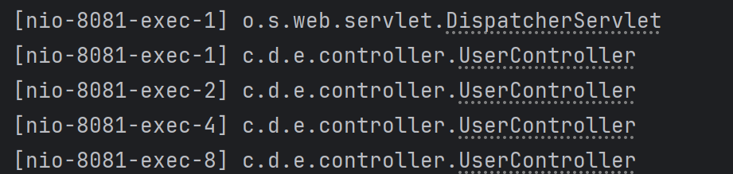
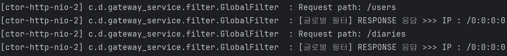

# 2025-03-10 월요일

## Spring Cloud Gateway와 Eureka

### 1. ID 정책명
- 각 라우팅 경로를 구분하기 위한 고유 식별자 설정
```
spring:
  cloud:
    gateway:
      routes:
        - id: user-service-route  # ID 정책명
          uri: lb://USER-SERVICE
```

### 2. URL 라우팅 위치
- URI를 통해 특정 서비스로 요청을 전달
- lb://는 Eureka를 이용한 로드밸런싱을 의미

```
uri:lb://ORDER-SERVICE # Eureka에서 등록한 서비스명 사용
```

### 3. Predicates (if문 역할)
- 특정 조건에 따라 라우팅 경로를 결정하는 기능
- Before : 특정 시간 이전에만 요청 허용
- After : 특정 시간 이후에만 요청 허용
- Between : 특정 시간 범위 내에서만 요청 허용
- Cookie : 특정 쿠키가 있을 때만 요청 허용

```
predicates:
  - Path=/api/users/**     # 특정 경로일 때만 라우팅
  - Before=2025-03-12T00:00:00+09:00  # 특정 날짜 이전만 허용
  - Cookie=SESSION_ID, abc123  # 특정 쿠키가 있을 때만 허용
```

- weight 전략 : 여러 인스턴스가 있을 때 특정 서비스로 트래픽을 분산하는 전략
- weight 값을 통해 트래픽의 비율을 조정
- 배포 전략 활용 
    - Canary 배포(새로운 버전의 서비스를 이룹 트래픽에만 적용해 테스트)
    - A/B 테스트(다른 서비스 버전으로 분할 트래픽)

```
routes:
  - id: user-service-v1
    uri: lb://USER-SERVICE
    predicates:
      - Path=/api/users/**
      - Weight=group1, 80  # 80% 트래픽 전달

  - id: user-service-v2
    uri: lb://USER-SERVICE
    predicates:
      - Path=/api/users/**
      - Weight=group1, 20  # 20% 트래픽 전달
```
- user-service-1은 80%의 트래픽을 받고,
- user-service-2는 20%의 트래픽을 받음
- 이를 통해 무중단 배포와 A/B 테스트가 가능능

### 4. Eureka 사용 : IP 등록
- Eureka : 서비스 디스커버리를 위한 레지스트리 서버
- 각 마이크로서비스가 Eureka에 자신의 IP를 등록
- Spring Cloud Gateway는 Eureka를 통해 서비스 위치(IP)를 조회
```
eureka:
  client:
    service-url:
      defaultZone: http://localhost:8761/eureka/
  instance:
    prefer-ip-address: true  # IP 기반 등록
```
- prefer-ip-address: true는 ip를 기준으로 Eureka에 등록하겠다는 설정

# 2025-03-11 화요일
## Spring Cloud Gateway & Eureka 기반 아키텍처 정리

### 1. Gateway의 필터 설정

- Global Filter(전역)
- Custom Filter(서비스 별)

Global Filter

- 모든 요청에 적용되는 필터
- JWT 적용 가능
- 캐싱 전략으로 성능 최적화 가능

Custom Filter

- 특정 서비스에만 적용되는 필터

### 2. Netty(SCG)와 Tomcat 차이

Tomcat




- nio : non blocking io
- exec-1, exec-2등 뒤에 붙은 번호는 스레드 번호
- 이처럼 tomcat은 다른 스레드가 **동기적**으로 실행됨

Netty(Spring Cloud Gateway)



- nio-2, 2, .. 뒤에 붙은 스레드 번호가 동일함
- 이처럼 Netty(SCG)는 하나의 스레드가 비동기적으로 실행됨
- 단, 비동기라서 순서대로 진행되어 오래 걸림

⇒ 캐싱 전략 사용 & RDB 사용 X

- DoS로 스레드를 소모시키는 공격 당할 수도 있음(성능 저하)

### 3. Eureka를 활용한 동적 서비스 확장

- Spring Cloud Gateway는 Eureka와 연동하여 서비스를 동적으로 관리할 수 있음
- Gateway는 30초마다 Eueka에서 서비스 목록을 가져와 동기화함
- 동적으로 Scale-out(서버가 늘어나면 자동 반영)
- Eureka에 이벤트 리스너 등록하여 자동으로 확장이 가능

(보통 Eureka 서버 2개, Gateway 서버 2개를 띄워 한 쪽이 다운되더라도 로드 밸런싱이 가능하게 설계함)

### 4. API Gateway & Eureka 통합 아키텍처

다음과 같은 흐름으로 동작함

1. user-service, diary-service가 실행되면 Eureka 서버에 등록됨
2. Gateway가 30초마다 Eureka에서 최신 서비스 목록을 동기화
3. 클라이언트가 Gateway로 요청
4. Gateway는 Eureka에서 user-service의 주소를 가져와 요청을 전달
5. JWT 검증등의 필터를 거쳐 서비스로 전달

# 2025-03-12 수요일
1. Eureka 서버 설정 완료
```
server:
  port: 8761  # 유레카 서버 default port

eureka:
  # 유레카 서버 자신이기 때문에 클라이언트 관련 설정은 false로 setting. (Default가 true이기 때문에 false로 변경해야 함)
  client:
    register-with-eureka: false # eureka server를 registry에 등록할지 여부
    fetch-registry: false       # registry에 있는 정보들을 가져올지 여부
```
2. Gateway 서버 설정 완료
```
  # 게이트웨이 설정
  cloud:
    gateway:
      default-filters:
        - GlobalFilter

      routes:
        - id: user-serivce
          uri: lb://user-service
          predicates:
            - Path=/api/users/**
```

# 2025-03-13 목요일
1. Gateway JWT 필터 설정
```
  # 게이트웨이 설정
  cloud:
    gateway:
      default-filters:
        - GlobalFilter

      routes:
        - id: user-serivce
          uri: lb://user-service
          predicates:
            - Path=/api/users/**
          filters:
            - name: JwtAuthFilter

        - id: auth-service
          uri: lb://user-service
          predicates:
            - Path=/api/auth/**

        - id: lucky-serivce
          uri: lb://lucky-service
          predicates:
            - Path=/api/lucky-numbers/**
          filters:
            - name: JwtAuthFilter
```

2. Gateway JWT 필터 분리
```
public class JwtAuthFilter  extends AbstractGatewayFilterFactory<JwtAuthFilter.Config> {
    private final JwtUtil jwtUtil;

    public JwtAuthFilter(JwtUtil jwtUtil) {
        super(JwtAuthFilter.Config.class);
        this.jwtUtil = jwtUtil;
    }

    public static class Config {
    }

    @Override
    public GatewayFilter apply(Config config) {
        return (exchange, chain) -> {
            String token = resolveToken(exchange);

            if (token != null && jwtUtil.validateToken(token)) {
                log.info("JWT 유효성 검증 성공");

                // JWT에서 사용자 정보 추출 (예: username, roles)
                Long userSeq = jwtUtil.getUserSeq(token);

                log.info("기존 userSeq : {}", userSeq);
                // 헤더에 사용자 정보 추가
                ServerWebExchange modifiedExchange = exchange.mutate()
                        .request(builder -> builder
                                .header("X-User-Seq", String.valueOf(userSeq))  // 사용자 ID 추가
                        )
                        .build();
                log.info("[JWT 필터] userSeq: {}", userSeq);
                return chain.filter(modifiedExchange);
            } else {
                log.warn("유효하지 않은 토큰 또는 없음");
            }

            exchange.getResponse().setStatusCode(HttpStatus.UNAUTHORIZED);
            return exchange.getResponse().setComplete();
        };
    }

    private String resolveToken(ServerWebExchange exchange) {
        String bearerToken = exchange.getRequest().getHeaders().getFirst(HttpHeaders.AUTHORIZATION);
        if (bearerToken != null && bearerToken.startsWith("Bearer ")) {
            return bearerToken.substring(7);
        }
        return null;
    }
}
```

3. JWT util
```
public class JwtUtil {
    private final Key key;

    public JwtUtil(@Value("${jwt.secret}") String secretKey) {
        byte[] keyBytes = Decoders.BASE64.decode(secretKey);
        this.key = Keys.hmacShaKeyFor(keyBytes);
    }

    public boolean validateToken(String token) {
        try {
            Jwts.parserBuilder().setSigningKey(key).build().parseClaimsJws(token);
            System.out.println(token);

            return true;
        } catch (ExpiredJwtException e) {
            log.warn("만료된 JWT 토큰");
        } catch (UnsupportedJwtException e) {
            log.warn("지원되지 않는 JWT 토큰");
        } catch (MalformedJwtException e) {
            log.warn("잘못된 JWT 토큰 형식");
        } catch (SignatureException e) {
            log.warn("유효하지 않은 JWT 서명");
        } catch (IllegalArgumentException e) {
            log.warn("JWT 토큰이 비어 있음");
        } catch (JwtException e) {
            log.warn("JWT 검증 실패: {}", e.getMessage());
        }
        return false;
    }

    public Long getUserSeq(String token) {
        return ((Number) Jwts.parserBuilder()
                .setSigningKey(key)
                .build()
                .parseClaimsJws(token)
                .getBody()
                .get("userSeq")).longValue();
    }
}
```

4. lucky-service(행운 번호 서비스) CRUD 생성

## JWT Filter는 어디에 추가 ?

- JwtAuthFilter를 인증이 필요한 모든 서비스에 추가
- 인증은 Authentication으로 사용자가 누구인지 확인하는 과정
- 인가는 Authorization으로 사용자가 어떤 기능을 사용할 수 있는지 확인하는 과정
- 인증은 로그인, 인가는 관리자와 사용자 구분 기능
- 해당 프로젝트는 인가가 필요없는 서비스(관리자X)라 인증만 사용

## Security 역할은 Gateway가 담당하는가 ?

### gateway-service
- 현재 gateway service에서는 Spring Security의 JwtAuthenticationFilter와 같은 역할을 대신 함함.
- 즉, 인증 필터 역할
- 만약 세부적인 권한 검사가 필요하다면 이는 개별 마이크로 서비스에서 진행이 될 것

### user-service
- 현재 user service는 로그인 처리 및 JWT 생성, gateway-service에서 전달한 사용자 정보를 활용
- gateway를 통과하긴 했지만 사용자의 역할이나 권한을 체크하지 않기 때문에 이를 이 곳에서 처리

### 따라서, Spring Security 역할은 여전히 user-service에서 진행하고, Spring security의 filter 역할만 gateway-service로 분리

=> 민감한 정보(token등)를 print 하는 테스트했을 때, dev 브랜치에 올리지 않도록 주의할 것것

