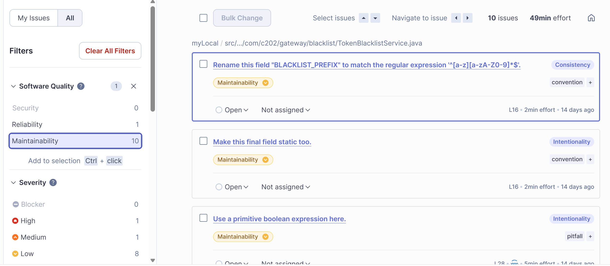

# 2025-3-31 월요일
## 1. RabbitMQ 사용
- 서비스 간 연결을 느슨하게 하기 위해 사용
- 비동기 처리로 부하를 줄이기 위해 사용
- (서비스를 유연하게, 장애에 강하고, 추후 확장이 쉬움)

### Kafka ?
- 프로젝트 내에서 서비스 간 이벤트 전달(탈퇴 -> 구독 삭제)
- 대량 스트림X
- 실시간으로 처리를 끝내고 싶음
- 개발, 운영 편리함 우선
- 따라서 Kafka가 아닌 RabbitMQ를 사용함함

## 2. 사용자 탈퇴시 구독 취소
### RabbitMQ는 크게 4가지 요소로 구성됨
- Producer -> Exchange -> Queue -> Consumer
- Producer : 메시지를 보내는 쪽
- Exchange : 메시지를 받아서, 어떤 Queue로 보낼지 결정 (라우팅팅)
- Queue : 메시지를 보관하고, 나중에 Consumer가 가져감
- Consumer : 메시지를 받아서 처리

### user-service의 config
```
package com.c202.user.user.config;


import org.springframework.amqp.core.Exchange;
import org.springframework.amqp.core.ExchangeBuilder;
import org.springframework.context.annotation.Bean;
import org.springframework.context.annotation.Configuration;

@Configuration
public class RabbitProducerConfig {

    @Bean
    public Exchange userExchange() {
        return ExchangeBuilder.topicExchange("user.event.exchange").durable(true).build();
    }
}
```
- user.event.exchange라는 이름의 토픽 기반 익스체인지를 등록해서, user-service에서 발생하는 이벤트 메시지를 RabbitMQ로 보내기 위한 준비를 하는 설정정

### userServiceImpl
```

        rabbitTemplate.convertAndSend("user.event.exchange", "user.withdrawn", userSeq);
```
- 익스체인지 설정을 실제로 메시지 전송하는 부분
- userSeq를 user.withdrawn이라는 라우팅 키로 user.event.exchange에 발행(publish) 한다

### subscrib-service의 config
```
package com.c202.subscribe.config;

import org.springframework.amqp.core.*;
import org.springframework.context.annotation.Bean;
import org.springframework.context.annotation.Configuration;

@Configuration
public class RabbitConsumerConfig {

    @Bean
    public Exchange userExchange() {
        return ExchangeBuilder.topicExchange("user.event.exchange").durable(true).build();
    }

    @Bean
    public Queue userWithdrawnQueue() {
        return QueueBuilder.durable("user.withdrawn.queue").build();
    }

    @Bean
    public Binding userWithdrawnBinding() {
        return BindingBuilder.bind(userWithdrawnQueue())
                .to(userExchange())
                .with("user.withdrawn")
                .noargs();
    }
}
```
- Consumer의 설정
- Producer랑 똑같이 user.event.exchange를 정의하고,
- 큐를 선언하고, 큐와 익스체인지를 라우팅키(withdrawn)로 바인딩

### subscribeServiceImpl
```
@RabbitListener(queues = "user.withdrawn.queue")
@Transactional
public void handleUserWithdrawn(Integer userSeq) {
    log.info("유저 탈퇴 이벤트 수신: userSeq = {}", userSeq);
    subscribeRepository.deleteBySubscriberSeq(userSeq);
    log.info("구독 정보 삭제 완료: userSeq = {}", userSeq);
}
```
- user.withdrawn.queue 큐로부터 유저 탈퇴 메시지를 받아서, 해당 유저의 구독정보를 DB에서 삭제

## 3. 구독 목록 조회시 구독자들 정보 추가
- 서비스는 MSA 구조로 이루어져있는데, 구독 서비스에서는 subscribedSeq만 존재하고, 닉네임이나 아이콘같은 프로필 정보가 없었음
- 프론트 쪽에서 닉네임, 아이콘 같은 프로필 정보를 요구함
- 따라서, 프로필 정보를 가지고 있는 user-service의 api를 사용해야 했음
- WebClient(다른 마이크로서비스에서 필요한 데이터를 REST API로 가져오기 위해) 사용)

### webclient
- WebClient는 Spring에서 권장하는 비동기/논블로킹 HTTP 통신 도구
- MSA 환경에서 API 호출, 이벤트 연동, 외부 서비스 연동 등에 적합하게 설계된 Client

```
    @Override
    public List<SubscriptionProfileDto> getSubscriptions(Integer subscriberSeq) {
        if (subscriberSeq == null) {
            throw new BadRequestException("구독자 정보가 유효하지 않습니다.");
        }
        // 1. 구독 대상 seq 목록 가져오기
        List<Integer> subscribedSeqList = subscribeRepository.findBySubscriberSeq(subscriberSeq)
                .stream()
                .map(Subscribe::getSubscribedSeq)
                .distinct()
                .collect(Collectors.toList());

        log.info("subscriberSeq = {}, subscribedSeqList = {}", subscriberSeq, subscribedSeqList);

        // 2. bulk 요청으로 user profile 조회
        Map<String, Object> response = webClientBuilder
                .baseUrl("http://user-service")
                .build()
                .post()
                .uri("/api/users/profiles")
                .bodyValue(subscribedSeqList)
                .retrieve()
                .bodyToMono(Map.class)
                .onErrorMap(ex -> new WebClientCommunicationException("WebClient 통신 에러: " + ex.getMessage()))
                .block();

        List<Map<String, Object>> profiles = (List<Map<String, Object>>) response.get("data");

        // 3. profile map 으로 변경
        Map<Integer, Map<String, Object>> profileMap = profiles.stream()
                .collect(Collectors.toMap(
                        p -> (Integer) p.get("userSeq"),
                        p -> p
                ));

        // 4. 구독 정보 + 프로필 합쳐서 반환
        return subscribedSeqList.stream()
                .map(subscribedSeq -> {
                    Map<String, Object> profile = profileMap.getOrDefault(subscribedSeq, null);
                    String nickname = profile != null ? (String) profile.getOrDefault("nickname", "알 수 없음") : "알 수 없음";
                    Integer iconSeq = profile != null ? (Integer) profile.getOrDefault("iconSeq", 0) : 0;

                    return SubscriptionProfileDto.builder()
                            .subscribedSeq(subscribedSeq)
                            .nickname(nickname)
                            .iconSeq(iconSeq)
                            .build();
                })
                .collect(Collectors.toList());
    }
```

# 2025-04-01 화요일
## 1. 오늘의 운세 하루 1회 제한
### AlreadyExistsException 추가
```
package com.c202.exception.types;

import com.c202.exception.CustomException;

public class AlreadyExistsException extends CustomException {
    public AlreadyExistsException(String message) {
        super(message, 409);
    }
}
```

### DailyFortuneServiceImpl
```
public void createDailyFortune(Integer userSeq) {
        if (dailyFortuneRepository.findByUserSeq(userSeq).isPresent()) {
            throw new AlreadyExistsException("오늘의 운세가 이미 생성되었습니다.");
        }
```
- 이미 생성한 경우 예외 반환

```
public String getDailyFortune(Integer userSeq) {
        return dailyFortuneRepository.findByUserSeq(userSeq)
                .map(DailyFortune::getContent)
                .orElse("오늘의 운세가 아직 생성되지 않았습니다.");
                .orElse(null);
    }
```
- 아직 생성되지 않은 경우 예외 대신 null 값 반환

### LuckyNumberServiceImpl
```
 if (luckyNumberRepository.findByUserSeq(userSeq).isPresent()) {
            throw new AlreadyExistsException("오늘은 이미 생성된 행운 번호가 있습니다");
    }
```
- 이미 생성한 경우 예외 반환
- 행운번호와 오늘의 운세의 경우 12시에 자동 초기화됨

```
 List<Integer> luckyNumbers = generateLuckyNumbers();
@@ -55,7 +56,7 @@ public class LuckyNumberServiceImpl implements LuckyNumberService {
                        luckyNumber.getNumber5(),
                        luckyNumber.getNumber6()
                ))
                .orElse(null);
    }
```
- 아직 생성되지 않은 경우 예외 대신 null 값 반환환


## 2. 유저 정보 조회시(닉네임) 구독 여부 추가
## 3. 유저 정보 조회시(이름) 구독 여부 추가

### SubscribeController
```
@GetMapping("/check/{subscribedSeq}")
    public String checkSubscription(
            @RequestHeader("X-User-Seq") Integer subscriberSeq,
            @PathVariable Integer subscribedSeq) {
        boolean result = subscribeService.isSubscribed(subscriberSeq, subscribedSeq).equals("Y");
        return result ? "Y" : "N";
    }
```
- 구독 여부를 조회하는 api 구현
- WebClient를 통해 호출되는 B2B(백엔드-백엔드) API 특성을 고려하여 단순 문자열 아닌 String 타입으로 응답
- ResponseEntity 대신 "Y"/"N"로 응답하여 바로 사용하도록 쉽게 설계함


### SubscribeService
```
    @Override
    public String isSubscribed(Integer subscriberSeq, Integer subscribedSeq) {
        if (subscriberSeq == null || subscribedSeq == null) {
            throw new BadRequestException("구독자 정보가 유효하지 않습니다.");
        }

        boolean result = subscribeRepository.findBySubscriberSeqAndSubscribedSeq(subscriberSeq, subscribedSeq).isPresent();

        return result ? "Y" : "N";
    }

```
- 로그인한 유저(subscriberSeq)가 특정 유저(subscribedSeq)를 구독했는지 반환하는 로직

### UserController
```
  @GetMapping("/seq/{otherSeq}")
    public ResponseEntity<ResponseDto<UserWithSubscriptionDto>> getUserByUserSeq(
            @PathVariable Integer otherSeq,
            @RequestHeader("X-User-Seq") @NotNull Integer userSeq) {

        UserWithSubscriptionDto user = userService.getUserByUserSeqWithSubscription(otherSeq, userSeq);
        return ResponseEntity.ok(ResponseDto.success(200, "사용자 정보 및 구독 여부 조회 성공", user));
```
- 로그인 유저는 userSeq, 대상 유저는 otherSeq

```
public ResponseEntity<ResponseDto<UserWithSubscriptionDto>> getUserByUsernameWithSubscription(
            @PathVariable String username,
            @RequestHeader("X-User-Seq") @NotNull Integer userSeq) {

        UserWithSubscriptionDto user = userService.getUserByUsernameWithSubscription(username, userSeq);
        return ResponseEntity.ok(ResponseDto.success(200, "사용자 정보 및 구독 여부 조회 성공", user));
```
- 로그인 유저는 userSeq, 대상 유저의 닉네임은 username

### UserWithSubscriptionDto
```
 public static UserWithSubscriptionDto from(User user, String isSubscribed) {
        return UserWithSubscriptionDto.builder()
                .userSeq(user.getUserSeq())
                .username(user.getUsername())
                .nickname(user.getNickname())
                .birthDate(user.getBirthDate())
                .introduction(user.getIntroduction())
                .iconSeq(user.getIconSeq())
                .isSubscribed(isSubscribed)
                .build();
    }
```
- 기존에 있던 User entity를 from(정적 팩토리 메서드)를 통해 isSubscribe정보를 함께 받아 객체로 만듦

### UserServiceImpl
```
 private String getSubscriptionStatus(Integer targetUserSeq, Integer subscriberSeq) {
        return webClientBuilder
                .baseUrl("http://subscribe-service")
                .build()
                .get()
                .uri("/api/subscription/check/{subscribedSeq}", targetUserSeq)
                .header("X-User-Seq", subscriberSeq.toString())
                .retrieve()
                .bodyToMono(String.class)
                .onErrorReturn("N")
                .block();
    }
```
- webclient를 이용하여 구독 여부 조회
- 공통 로직을 모듈화함

```
  @Override
    public UserWithSubscriptionDto getUserByUsernameWithSubscription(String username, Integer subscriberSeq) {
        User targetUser = userRepository.findByUsernameAndIsDeleted(username, "N")
                .orElseThrow(() -> new NotFoundException("사용자를 찾을 수 없습니다."));

        String isSubscribed = getSubscriptionStatus(targetUser.getUserSeq(), subscriberSeq);

        return UserWithSubscriptionDto.from(targetUser, isSubscribed);
    }

    @Override
    public UserWithSubscriptionDto getUserByUserSeqWithSubscription(Integer userSeq, Integer subscriberSeq) {
        User targetUser = validateUser(userSeq);

        String isSubscribed = getSubscriptionStatus(targetUser.getUserSeq(), subscriberSeq);

        return UserWithSubscriptionDto.from(targetUser, isSubscribed);
    }
```
- getUserByUsernameWithSubscription와 getUserByUserSeqWithSubscription에서 위의 모듈을 사용하여 구독 여부를 return

# 2025-04-02 수요일
## 1. 소나큐브
- 코드 품질과 보안을 자동으로 분석하고 관리하기 위해 사용하는 정적 분석 도구
- 코드 품질 확보, 보안 취약점 탐지, 테스트 커버리지 확인, 리팩토링 가이드를 위해 사용
- 젠킨스와 연동하고 싶었지만, 이미 젠킨스에 올라간 docker가 21개이므로, 로컬에서만 확인

### docker-compose.yml
```
version: "3"
services:
  sonarqube:
    image: sonarqube:latest
    ports:
      - "9000:9000"
    environment:
      - SONAR_ES_BOOTSTRAP_CHECKS_DISABLE=true
    volumes:
      - sonarqube_data:/opt/sonarqube/data
      - sonarqube_logs:/opt/sonarqube/logs
      - sonarqube_extensions:/opt/sonarqube/extensions

volumes:
  sonarqube_data:
  sonarqube_logs:
  sonarqube_extensions:
```
- 9000번 포트에서 소나큐브 활성화
- Maven 프로젝트이기 때문에, 각 프로젝트에 sonar-maven-plugin을 추가

```
<plugin>
				<groupId>org.sonarsource.scanner.maven</groupId>
				<artifactId>sonar-maven-plugin</artifactId>
				<version>3.9.1.2184</version>
			</plugin>
```

- 각 프로젝트에서 mvnw 명령어 실행
```
./mvnw clean verify -DskipTests sonar:sonar -Dsonar.projectKey=이름 -Dsonar.projectName=이름 -Dsonar.host.url=http://localhost:9000 -Dsonar.token=토큰
```

### 결과


## 2. 리펙토링
- 사용하지 않는 import 제거
- System.out.println 대신 log 사용
- Collectors.toList()를 toList()로 줄여서 가독성 향상 (공식 권장)
- 불필요한 객체 생성을 제거하고, static으로 만들어서 여러 번 재사용할 수 있게 만듦

```
return new Random() 대신에

private static final Random RANDOM = new Random();
return RANDOM. 사용
```

### print VS log..
1. 로그는 info, warn, error, debug, trace처럼 레벨을 나눠서 출력 가능하기 때문에, 운영중에 필요한 정보만 볼 수 있음
2. log는 로그 파일이나, 모니터링 시스템으로 연동 가능함.
3. System.out.println은 문자열 연산이 발생하기 때문에 불필요한 비용이 발생.
4. 특히, System.out.println()은 동기적이기 때문에, 출력이 완료될 때까지 코드가 멈춤. logging은 비동기 로깅
5. 따라서, 실시간 트래픽이 많은 서비스에서는 비동기 로깅을 사용해야 함.
